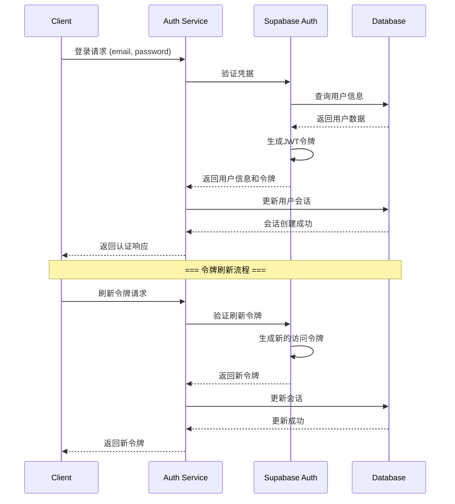

# 11. Backend Architecture

## Service Architecture

由于我们采用Next.js API Routes，这里使用Serverless架构：

### Function Organization

```
src/app/api/
├── auth/
│   ├── login/
│   │   └── route.ts
│   ├── register/
│   │   └── route.ts
│   └── logout/
│       └── route.ts
├── work-records/
│   ├── route.ts
│   └── [id]/
│       ├── route.ts
│       └── summary/
│           └── route.ts
├── summaries/
│   ├── route.ts
│   └── [id]/
│       └── route.ts
├── tags/
│   └── route.ts
├── ai-services/
│   ├── route.ts
│   └── [id]/
│       └── route.ts
├── analytics/
│   ├── trends/
│   │   └── route.ts
│   └── time-distribution/
│       └── route.ts
└── exports/
    └── route.ts
```

### Function Template

```typescript
// src/app/api/work-records/route.ts
import { NextRequest, NextResponse } from 'next/server'
import { createServerComponentClient } from '@supabase/auth-helpers-nextjs'
import { cookies } from 'next/headers'
import { workRecordService } from '@/services/work-record.service'
import {
  createWorkRecordSchema,
  updateWorkRecordSchema,
} from '@/lib/validations'
import { z } from 'zod'

export async function GET(request: NextRequest) {
  try {
    const supabase = createServerComponentClient({ cookies })
    const {
      data: { session },
    } = await supabase.auth.getSession()

    if (!session) {
      return NextResponse.json({ error: 'Unauthorized' }, { status: 401 })
    }

    const { searchParams } = new URL(request.url)
    const params = {
      page: searchParams.get('page')
        ? parseInt(searchParams.get('page')!)
        : undefined,
      limit: searchParams.get('limit')
        ? parseInt(searchParams.get('limit')!)
        : undefined,
      tags: searchParams.get('tags')?.split(','),
      date_from: searchParams.get('date_from') || undefined,
      date_to: searchParams.get('date_to') || undefined,
      search: searchParams.get('search') || undefined,
    }

    const workRecords = await workRecordService.getWorkRecords(
      session.user.id,
      params
    )

    return NextResponse.json(workRecords)
  } catch (error) {
    console.error('Error fetching work records:', error)
    return NextResponse.json(
      { error: 'Internal server error' },
      { status: 500 }
    )
  }
}

export async function POST(request: NextRequest) {
  try {
    const supabase = createServerComponentClient({ cookies })
    const {
      data: { session },
    } = await supabase.auth.getSession()

    if (!session) {
      return NextResponse.json({ error: 'Unauthorized' }, { status: 401 })
    }

    const body = await request.json()

    try {
      const validatedData = createWorkRecordSchema.parse(body)
      const workRecord = await workRecordService.createWorkRecord(
        session.user.id,
        validatedData
      )

      return NextResponse.json(workRecord, { status: 201 })
    } catch (validationError) {
      if (validationError instanceof z.ZodError) {
        return NextResponse.json(
          {
            error: 'Validation error',
            details: validationError.errors,
          },
          { status: 400 }
        )
      }
      throw validationError
    }
  } catch (error) {
    console.error('Error creating work record:', error)
    return NextResponse.json(
      { error: 'Internal server error' },
      { status: 500 }
    )
  }
}
```

## Database Architecture

### Schema Design

```typescript
// src/lib/db/schema.ts
import {
  pgTable,
  text,
  uuid,
  timestamp,
  boolean,
  jsonb,
  integer,
  pgTableCreator,
} from 'drizzle-orm/pg-core'

const pgTable = pgTableCreator(name => `work_logger_${name}`)

// 用户表
export const users = pgTable('users', {
  id: uuid('id').primaryKey().defaultRandom(),
  email: text('email').notNull().unique(),
  name: text('name').notNull(),
  avatar_url: text('avatar_url'),
  created_at: timestamp('created_at').notNull().defaultNow(),
  updated_at: timestamp('updated_at').notNull().defaultNow(),
  preferences: jsonb('preferences').default('{}').notNull(),
})

// 工作记录表
export const workRecords = pgTable('work_records', {
  id: uuid('id').primaryKey().defaultRandom(),
  user_id: uuid('user_id')
    .notNull()
    .references(() => users.id, { onDelete: 'cascade' }),
  title: text('title').notNull(),
  content: text('content').notNull(),
  tags: text('tags').array().notNull().default('{}'),
  created_at: timestamp('created_at').notNull().defaultNow(),
  updated_at: timestamp('updated_at').notNull().defaultNow(),
  is_pinned: boolean('is_pinned').default(false).notNull(),
  metadata: jsonb('metadata').default('{}').notNull(),
})

// 标签表
export const tags = pgTable('tags', {
  id: uuid('id').primaryKey().defaultRandom(),
  user_id: uuid('user_id')
    .notNull()
    .references(() => users.id, { onDelete: 'cascade' }),
  name: text('name').notNull(),
  color: text('color').notNull(),
  created_at: timestamp('created_at').notNull().defaultNow(),
  usage_count: integer('usage_count').default(0).notNull(),
})

// 工作记录-标签关联表
export const workRecordTags = pgTable(
  'work_record_tags',
  {
    work_record_id: uuid('work_record_id')
      .notNull()
      .references(() => workRecords.id, { onDelete: 'cascade' }),
    tag_id: uuid('tag_id')
      .notNull()
      .references(() => tags.id, { onDelete: 'cascade' }),
  },
  table => ({
    pk: primaryKey({ columns: [table.work_record_id, table.tag_id] }),
  })
)

// 总结表
export const summaries = pgTable('summaries', {
  id: uuid('id').primaryKey().defaultRandom(),
  user_id: uuid('user_id')
    .notNull()
    .references(() => users.id, { onDelete: 'cascade' }),
  work_record_ids: uuid('work_record_ids').array().notNull(),
  content: text('content').notNull(),
  ai_provider: text('ai_provider').notNull(),
  model: text('model').notNull(),
  prompt_template_id: uuid('prompt_template_id').references(
    () => promptTemplates.id,
    { onDelete: 'set null' }
  ),
  quality_score: integer('quality_score').notNull(),
  created_at: timestamp('created_at').notNull().defaultNow(),
  metadata: jsonb('metadata').default('{}').notNull(),
})

// 其他表定义...
```

### Data Access Layer

```typescript
// src/lib/db/index.ts
import { drizzle } from 'drizzle-orm/postgres-js'
import postgres from 'postgres'
import * as schema from './schema'

const connectionString = process.env.DATABASE_URL!
const client = postgres(connectionString, { prepare: false })

export const db = drizzle(client, { schema })

// 数据库连接和查询工具
export class DatabaseService {
  static async transaction<T>(
    callback: (tx: typeof db) => Promise<T>
  ): Promise<T> {
    return await client.begin(async tx => {
      const dbTx = drizzle(tx, { schema })
      return await callback(dbTx as any)
    })
  }

  static async healthCheck(): Promise<boolean> {
    try {
      await client`SELECT 1`
      return true
    } catch (error) {
      console.error('Database health check failed:', error)
      return false
    }
  }
}
```

### Repository Pattern

```typescript
// src/repositories/work-record.repository.ts
import { eq, and, desc, or, ilike } from 'drizzle-orm'
import { db } from '@/lib/db'
import { workRecords, workRecordTags, tags } from '@/lib/db/schema'
import { CreateWorkRecord, UpdateWorkRecord } from '@/types/api.types'

export class WorkRecordRepository {
  static async findById(id: string, userId: string) {
    const result = await db
      .select()
      .from(workRecords)
      .where(and(eq(workRecords.id, id), eq(workRecords.user_id, userId)))
      .limit(1)

    return result[0] || null
  }

  static async findAll(
    userId: string,
    params: {
      page?: number
      limit?: number
      tags?: string[]
      date_from?: string
      date_to?: string
      search?: string
    } = {}
  ) {
    const { page = 1, limit = 20, tags, date_from, date_to, search } = params
    const offset = (page - 1) * limit

    let whereCondition = eq(workRecords.user_id, userId)

    if (tags && tags.length > 0) {
      whereCondition = and(
        whereCondition,
        or(
          ...tags.map(tag => sql`${workRecords.tags}::text[] @> ARRAY[${tag}]`)
        )
      )
    }

    if (date_from) {
      whereCondition = and(
        whereCondition,
        gte(workRecords.created_at, new Date(date_from))
      )
    }

    if (date_to) {
      whereCondition = and(
        whereCondition,
        lte(workRecords.created_at, new Date(date_to))
      )
    }

    if (search) {
      whereCondition = and(
        whereCondition,
        or(
          ilike(workRecords.title, `%${search}%`),
          ilike(workRecords.content, `%${search}%`)
        )
      )
    }

    const [data, totalCount] = await Promise.all([
      db
        .select()
        .from(workRecords)
        .where(whereCondition)
        .orderBy(desc(workRecords.created_at))
        .limit(limit)
        .offset(offset),

      db
        .select({ count: sql<number>`count(*)` })
        .from(workRecords)
        .where(whereCondition),
    ])

    return {
      data,
      pagination: {
        page,
        limit,
        total: totalCount[0].count,
        pages: Math.ceil(totalCount[0].count / limit),
      },
    }
  }

  static async create(userId: string, data: CreateWorkRecord) {
    const [workRecord] = await db
      .insert(workRecords)
      .values({
        ...data,
        user_id: userId,
        metadata: {
          ...data.metadata,
          word_count: data.content.split(' ').length,
          reading_time: Math.ceil(data.content.split(' ').length / 200),
        },
      })
      .returning()

    return workRecord
  }

  static async update(id: string, userId: string, data: UpdateWorkRecord) {
    const [workRecord] = await db
      .update(workRecords)
      .set({
        ...data,
        updated_at: new Date(),
        metadata: data.content
          ? {
              word_count: data.content.split(' ').length,
              reading_time: Math.ceil(data.content.split(' ').length / 200),
            }
          : undefined,
      })
      .where(and(eq(workRecords.id, id), eq(workRecords.user_id, userId)))
      .returning()

    return workRecord
  }

  static async delete(id: string, userId: string) {
    const [deleted] = await db
      .delete(workRecords)
      .where(and(eq(workRecords.id, id), eq(workRecords.user_id, userId)))
      .returning()

    return deleted
  }
}
```

## Auth Architecture

### Auth Flow



### Middleware/Guards

```typescript
// src/lib/middleware/auth.ts
import { NextRequest, NextResponse } from 'next/server'
import { createServerClient } from '@supabase/auth-helpers-nextjs'
import { cookies } from 'next/headers'

export async function middleware(request: NextRequest) {
  const res = NextResponse.next()
  const supabase = createServerClient(
    process.env.NEXT_PUBLIC_SUPABASE_URL!,
    process.env.NEXT_PUBLIC_SUPABASE_ANON_KEY!,
    {
      cookies: {
        getAll() {
          return request.cookies.getAll()
        },
        setAll(cookiesToSet) {
          cookiesToSet.forEach(({ name, value, options }) => {
            request.cookies.set(name, value)
            res.cookies.set(name, value, options)
          })
        },
      },
    }
  )

  const {
    data: { session },
  } = await supabase.auth.getSession()

  // 保护仪表板路由
  if (request.nextUrl.pathname.startsWith('/(dashboard)')) {
    if (!session) {
      const redirectUrl = new URL('/auth/login', request.url)
      redirectUrl.searchParams.set('redirectTo', request.nextUrl.pathname)
      return NextResponse.redirect(redirectUrl)
    }
  }

  // 重定向已认证用户离开认证页面
  if (request.nextUrl.pathname.startsWith('/(auth)') && session) {
    return NextResponse.redirect(new URL('/(dashboard)', request.url))
  }

  return res
}

export const config = {
  matcher: [
    '/((?!_next/static|_next/image|favicon.ico|.*\\.(?:svg|png|jpg|jpeg|gif|webp)$).*)',
  ],
}
```
