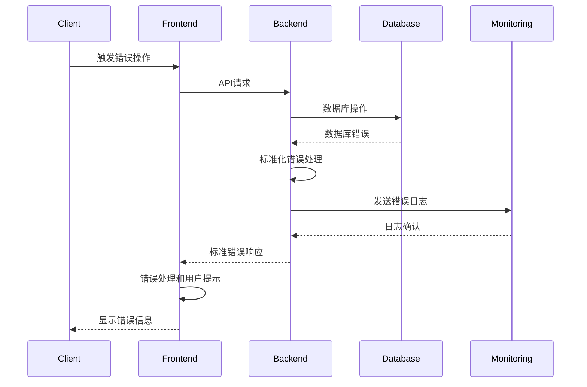

# 18. Error Handling Strategy

## Error Flow



## Error Response Format

```typescript
// src/types/error.types.ts
interface ApiError {
  error: {
    code: string
    message: string
    details?: Record<string, any>
    timestamp: string
    requestId: string
  }
}

// 错误代码枚举
export enum ErrorCode {
  VALIDATION_ERROR = 'VALIDATION_ERROR',
  AUTHENTICATION_ERROR = 'AUTHENTICATION_ERROR',
  AUTHORIZATION_ERROR = 'AUTHORIZATION_ERROR',
  NOT_FOUND = 'NOT_FOUND',
  INTERNAL_ERROR = 'INTERNAL_ERROR',
  RATE_LIMIT_EXCEEDED = 'RATE_LIMIT_EXCEEDED',
  EXTERNAL_SERVICE_ERROR = 'EXTERNAL_SERVICE_ERROR',
}
```

## Frontend Error Handler

```typescript
// src/lib/error-handler.ts
import { toast } from '@/components/ui/toaster'

export class ErrorHandler {
  static handleApiError(error: any) {
    if (error.response?.data?.error) {
      const apiError = error.response.data.error

      switch (apiError.code) {
        case 'VALIDATION_ERROR':
          toast.error('输入数据格式错误')
          break
        case 'AUTHENTICATION_ERROR':
          toast.error('请先登录')
          // 重定向到登录页
          window.location.href = '/auth/login'
          break
        case 'AUTHORIZATION_ERROR':
          toast.error('权限不足')
          break
        case 'NOT_FOUND':
          toast.error('资源不存在')
          break
        case 'RATE_LIMIT_EXCEEDED':
          toast.error('请求过于频繁，请稍后再试')
          break
        case 'EXTERNAL_SERVICE_ERROR':
          toast.error('外部服务暂时不可用')
          break
        default:
          toast.error('操作失败，请稍后再试')
      }
    } else {
      toast.error('网络错误，请检查连接')
    }

    // 发送错误到监控服务
    this.logError(error)
  }

  static handleUnexpectedError(error: any) {
    console.error('Unexpected error:', error)
    toast.error('发生未知错误')
    this.logError(error)
  }

  private static logError(error: any) {
    // 发送到错误监控服务
    if (process.env.NODE_ENV === 'production') {
      // Sentry或其他错误监控服务
      console.log('Error logged to monitoring service:', error)
    }
  }
}
```

## Backend Error Handler

```typescript
// src/lib/error-handler.ts
import { NextRequest, NextResponse } from 'next/server'
import { ErrorCode } from '@/types/error.types'

export class ApiError extends Error {
  constructor(
    public code: ErrorCode,
    message: string,
    public details?: Record<string, any>
  ) {
    super(message)
    this.name = 'ApiError'
  }
}

export function createErrorResponse(
  error: ApiError,
  status: number = 500
): NextResponse {
  return NextResponse.json(
    {
      error: {
        code: error.code,
        message: error.message,
        details: error.details,
        timestamp: new Date().toISOString(),
        requestId: crypto.randomUUID(),
      },
    },
    { status }
  )
}

export function handleApiError(error: any): NextResponse {
  console.error('API Error:', error)

  if (error instanceof ApiError) {
    const statusMap = {
      [ErrorCode.VALIDATION_ERROR]: 400,
      [ErrorCode.AUTHENTICATION_ERROR]: 401,
      [ErrorCode.AUTHORIZATION_ERROR]: 403,
      [ErrorCode.NOT_FOUND]: 404,
      [ErrorCode.RATE_LIMIT_EXCEEDED]: 429,
      [ErrorCode.EXTERNAL_SERVICE_ERROR]: 502,
      [ErrorCode.INTERNAL_ERROR]: 500,
    }

    return createErrorResponse(error, statusMap[error.code] || 500)
  }

  if (error.code === 'PGRST116') {
    // Postgres not found error
    return createErrorResponse(
      new ApiError(ErrorCode.NOT_FOUND, 'Resource not found'),
      404
    )
  }

  // 默认内部服务器错误
  return createErrorResponse(
    new ApiError(ErrorCode.INTERNAL_ERROR, 'Internal server error'),
    500
  )
}
```
