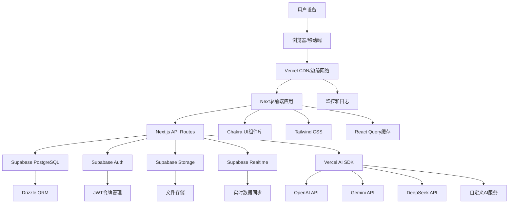

# 2. High Level Architecture

## Technical Summary
本系统采用现代化的全栈架构，基于Next.js App Router构建，结合Supabase作为后端即服务（BaaS）平台。前端使用React和Chakra UI实现响应式用户界面，后端通过Next.js API Routes提供RESTful API服务。系统采用Jamstack架构模式，实现高性能、可扩展性和安全性。通过Vercel AI SDK集成多个AI服务提供商，支持智能工作记录总结功能。整体架构设计注重用户体验、开发效率和运维便利性，完全满足PRD中定义的功能和非功能性需求。

## Platform and Infrastructure Choice
**Platform:** Vercel + Supabase
**Key Services:** Vercel (前端部署、边缘网络、函数计算), Supabase (PostgreSQL数据库、认证、实时功能、存储), Vercel AI SDK (AI服务集成)
**Deployment Host and Regions:** Vercel全球边缘网络，Supabase多区域部署（根据用户地理位置选择最近的区域）

**选择理由：**
- **开发效率**：Vercel和Supabase提供开箱即用的解决方案，大幅减少基础设施配置时间
- **技术栈一致性**：与PRD中指定的Next.js、Supabase、Vercel AI SDK完美匹配
- **成本效益**：免费层和按需付费模式，适合项目初期和成长阶段
- **可扩展性**：Vercel的边缘网络和Supabase的自动扩展能力支持业务增长
- **维护简便**：托管服务减少运维负担，团队可专注于业务逻辑开发

## Repository Structure
**Structure:** Monorepo
**Monorepo Tool:** Turborepo
**Package Organization:** 
- `apps/` 包含前端应用和API服务
- `packages/` 包含共享类型、工具和UI组件
- `infrastructure/` 包含基础设施即代码配置
- `docs/` 包含项目文档

**选择理由：**
- **代码共享**：前端和后端可以共享TypeScript类型和工具函数
- **依赖管理**：统一管理依赖版本，避免冲突
- **开发体验**：单个仓库中同时开发前端和后端，提高协作效率
- **构建优化**：Turborepo支持并行构建和智能缓存，提升构建速度

## High Level Architecture Diagram

## Architectural Patterns
- **Jamstack Architecture:** 静态站点生成与无服务器API结合 - _Rationale:_ 为内容密集型应用提供最佳性能和可扩展性
- **组件化UI:** 可复用的React组件与TypeScript - _Rationale:_ 在大型代码库中保持可维护性和类型安全
- **Repository Pattern:** 抽象数据访问逻辑 - _Rationale:_ 支持测试和未来数据库迁移的灵活性
- **API Gateway Pattern:** 所有API调用的单一入口点 - _Rationale:_ 集中化认证、速率限制和监控
- **CQRS模式:** 读写操作分离 - _Rationale:_ 优化查询性能和复杂业务逻辑处理
- **事件驱动架构:** 使用Supabase Realtime进行实时更新 - _Rationale:_ 提供实时用户体验和系统解耦
- **微前端架构:** 模块化前端组件 - _Rationale:_ 支持独立开发和部署功能模块
