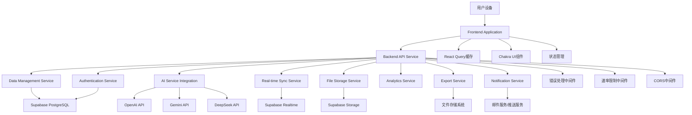

# 6. Components

## Frontend Application
**Responsibility:** 提供用户界面，处理用户交互，管理前端状态，与后端API通信

**Key Interfaces:**
- REST API客户端接口
- React组件接口
- 状态管理接口
- 路由导航接口

**Dependencies:** Next.js, React, Chakra UI, React Query, Zustand (或React Context)

**Technology Stack:** TypeScript, Next.js 14+, React 18+, Chakra UI 2.8+, React Query 5.0+, Tailwind CSS 3.4+

## Backend API Service
**Responsibility:** 处理HTTP请求，实现业务逻辑，管理数据访问，提供RESTful API

**Key Interfaces:**
- REST API端点
- 数据库访问接口
- 认证中间件
- 错误处理接口

**Dependencies:** Next.js API Routes, Supabase, Drizzle ORM, JWT

**Technology Stack:** TypeScript, Next.js 14+, Supabase (PostgreSQL), Drizzle ORM, jsonwebtoken

## AI Service Integration
**Responsibility:** 管理与多个AI服务提供商的集成，处理AI请求和响应，提供统一的AI服务接口

**Key Interfaces:**
- AI服务提供商接口
- 提示模板接口
- 总结生成接口
- 质量评估接口

**Dependencies:** Vercel AI SDK, OpenAI API, Gemini API, DeepSeek API

**Technology Stack:** TypeScript, Vercel AI SDK, OpenAI, Google AI, DeepSeek SDK

## Data Management Service
**Responsibility:** 管理数据模型，处理数据验证，实现数据访问层，提供数据同步功能

**Key Interfaces:**
- 数据模型接口
- 数据验证接口
- 数据同步接口
- 缓存接口

**Dependencies:** Drizzle ORM, Supabase, Redis (通过Supabase)

**Technology Stack:** TypeScript, Drizzle ORM, Supabase, Zod (数据验证)

## Authentication Service
**Responsibility:** 处理用户认证和授权，管理JWT令牌，实现权限控制

**Key Interfaces:**
- 用户认证接口
- 令牌管理接口
- 权限验证接口
- 会话管理接口

**Dependencies:** Supabase Auth, JWT, Next.js Middleware

**Technology Stack:** TypeScript, Supabase Auth, jsonwebtoken, Next.js Middleware

## Real-time Sync Service
**Responsibility:** 实现实时数据同步，管理WebSocket连接，处理实时事件

**Key Interfaces:**
- 实时事件接口
- WebSocket连接接口
- 数据同步接口
- 离线同步接口

**Dependencies:** Supabase Realtime, WebSocket API

**Technology Stack:** TypeScript, Supabase Realtime, WebSocket API

## File Storage Service
**Responsibility:** 管理文件上传、下载和存储，处理文件格式转换，提供CDN加速

**Key Interfaces:**
- 文件上传接口
- 文件下载接口
- 文件管理接口
- CDN接口

**Dependencies:** Supabase Storage, Vercel Blob (可选)

**Technology Stack:** TypeScript, Supabase Storage, Multer (文件处理)

## Analytics Service
**Responsibility:** 收集和分析用户数据，生成统计报告，提供数据可视化支持

**Key Interfaces:**
- 数据收集接口
- 分析计算接口
- 报告生成接口
- 可视化数据接口

**Dependencies:** Recharts/Chart.js, Drizzle ORM, Supabase

**Technology Stack:** TypeScript, Recharts 2.8+, Drizzle ORM, Supabase

## Export Service
**Responsibility:** 处理数据导出请求，生成各种格式的导出文件，管理导出任务队列

**Key Interfaces:**
- 导出任务接口
- 文件生成接口
- 格式转换接口
- 队列管理接口

**Dependencies:** PDFKit, CSV-Stringify, JS-YAML, Bull (队列)

**Technology Stack:** TypeScript, PDFKit, csv-stringify, js-yaml, Bull (队列)

## Notification Service
**Responsibility:** 管理用户通知，处理邮件和推送通知，提供通知模板

**Key Interfaces:**
- 通知发送接口
- 通知模板接口
- 用户偏好接口
- 队列管理接口

**Dependencies:** Nodemailer (邮件), Web Push API, Supabase

**Technology Stack:** TypeScript, Nodemailer, Web Push API, Supabase

## Component Diagrams

