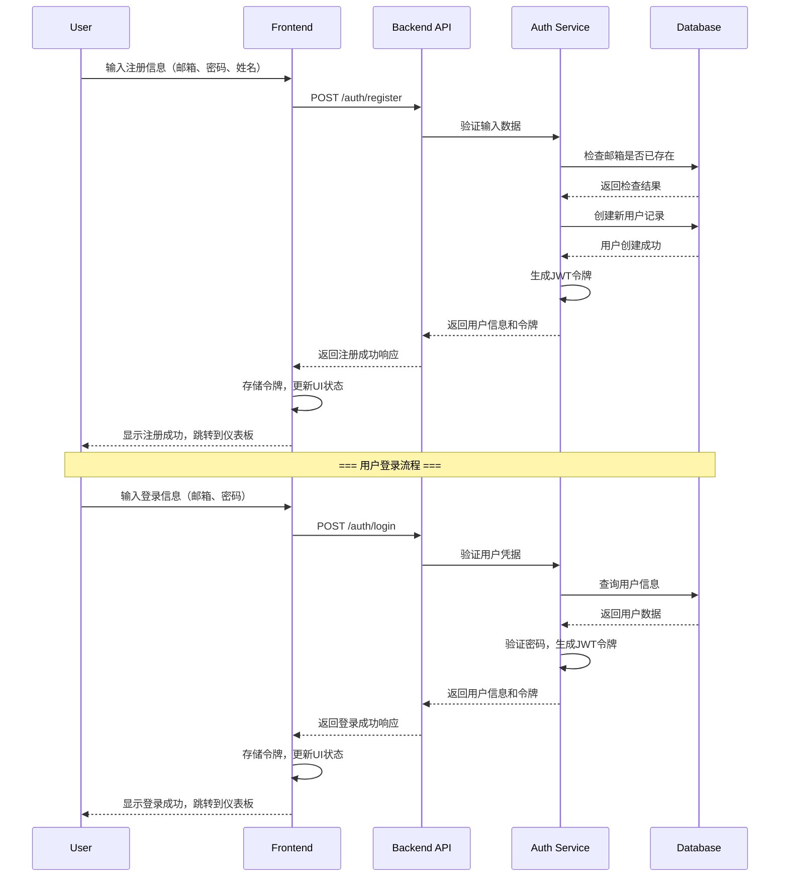
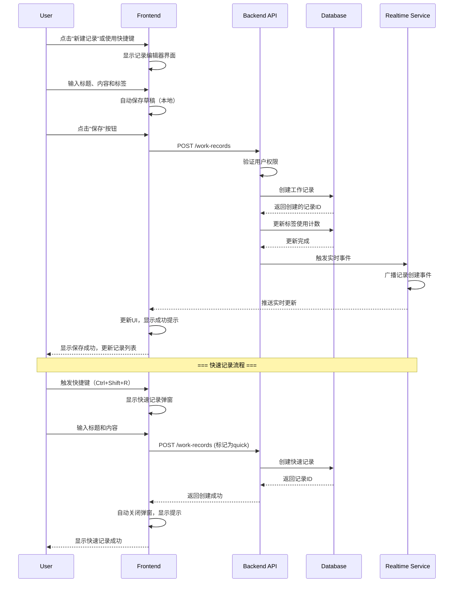
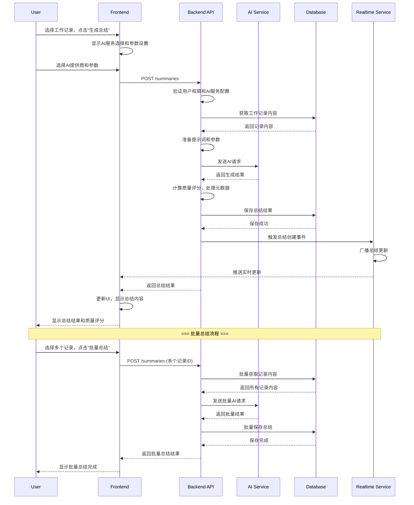
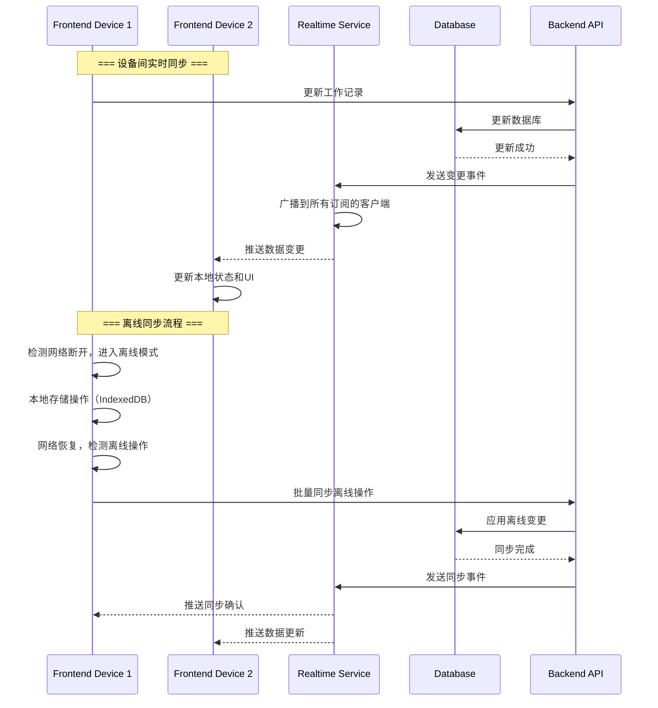
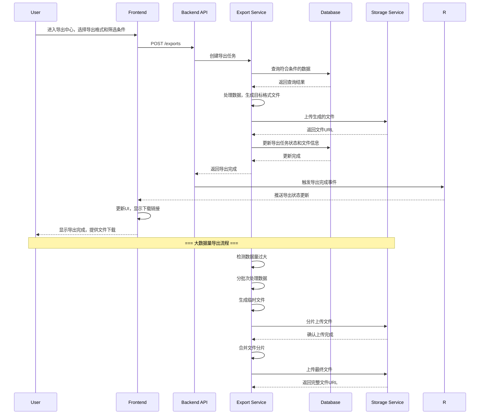

# 8. Core Workflows

## Workflow 1: User Registration and Login

## Workflow 2: Creating a Work Record

## Workflow 3: Generating AI Summary

## Workflow 4: Real-time Data Synchronization

## Workflow 5: Data Export

