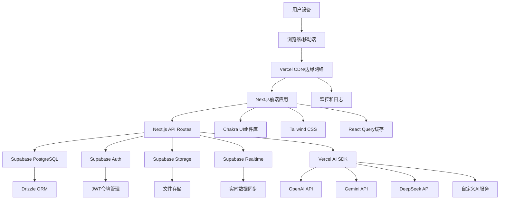
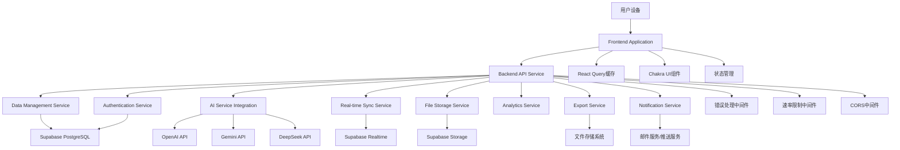
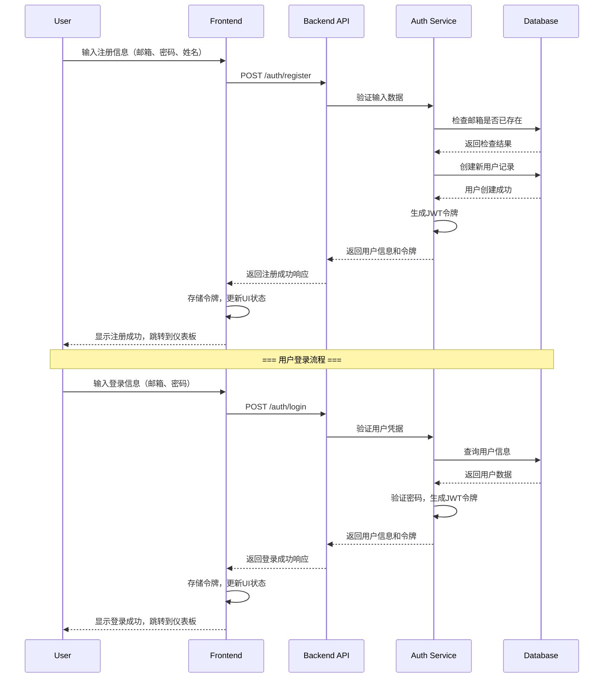
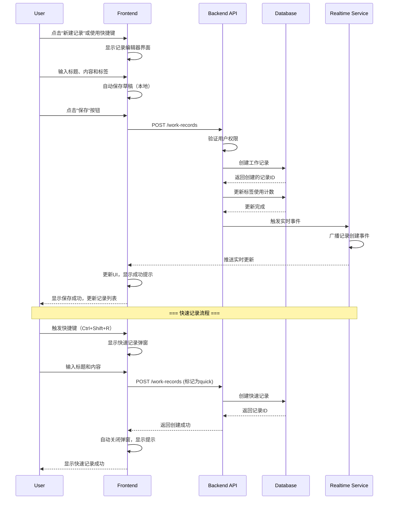
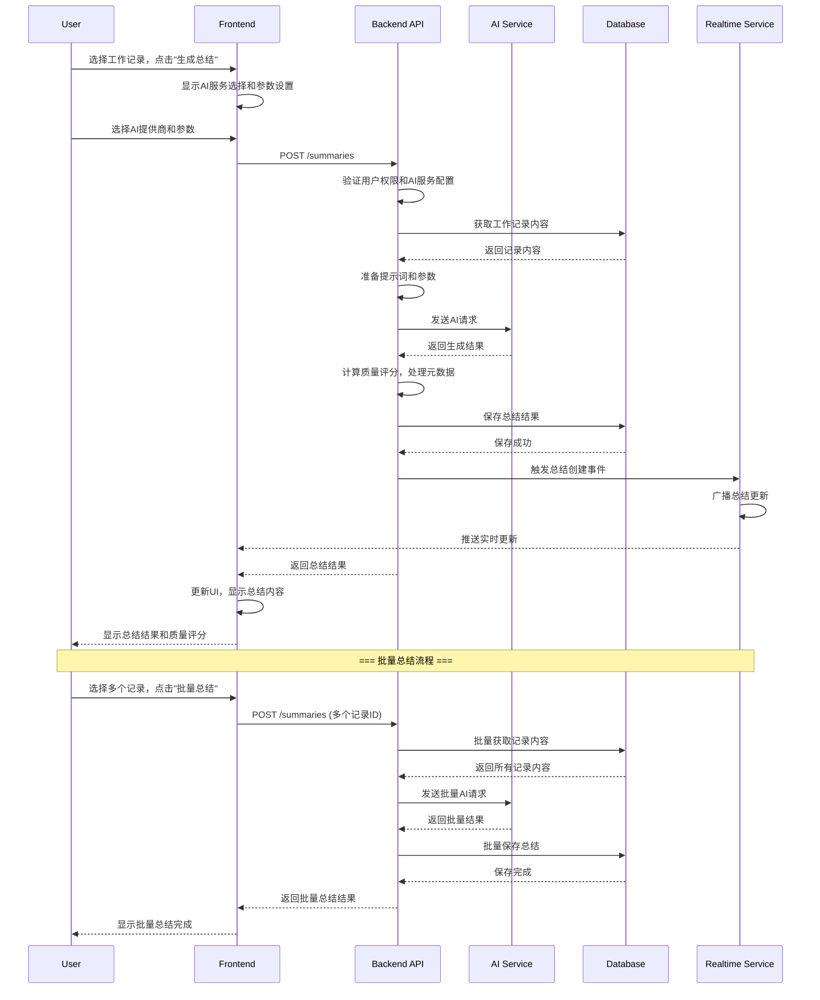
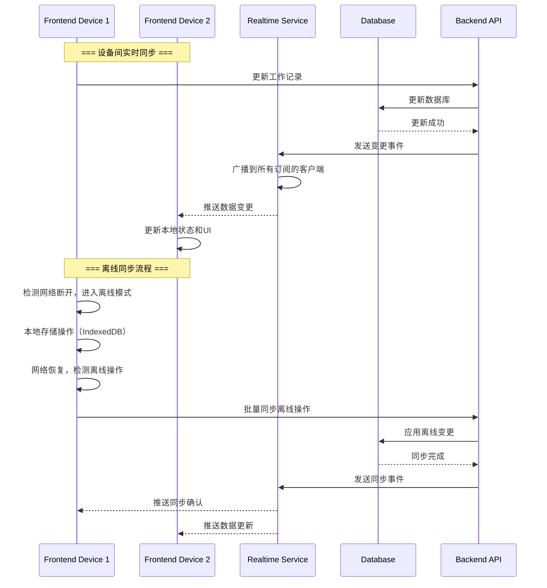
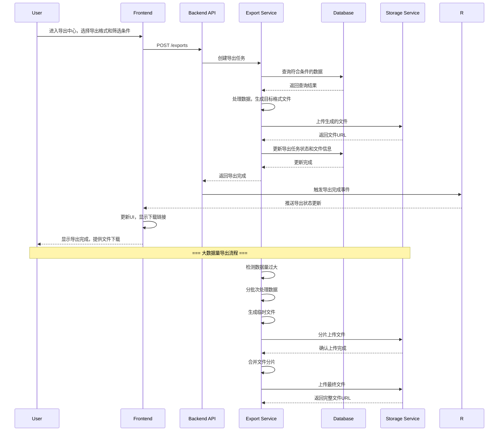
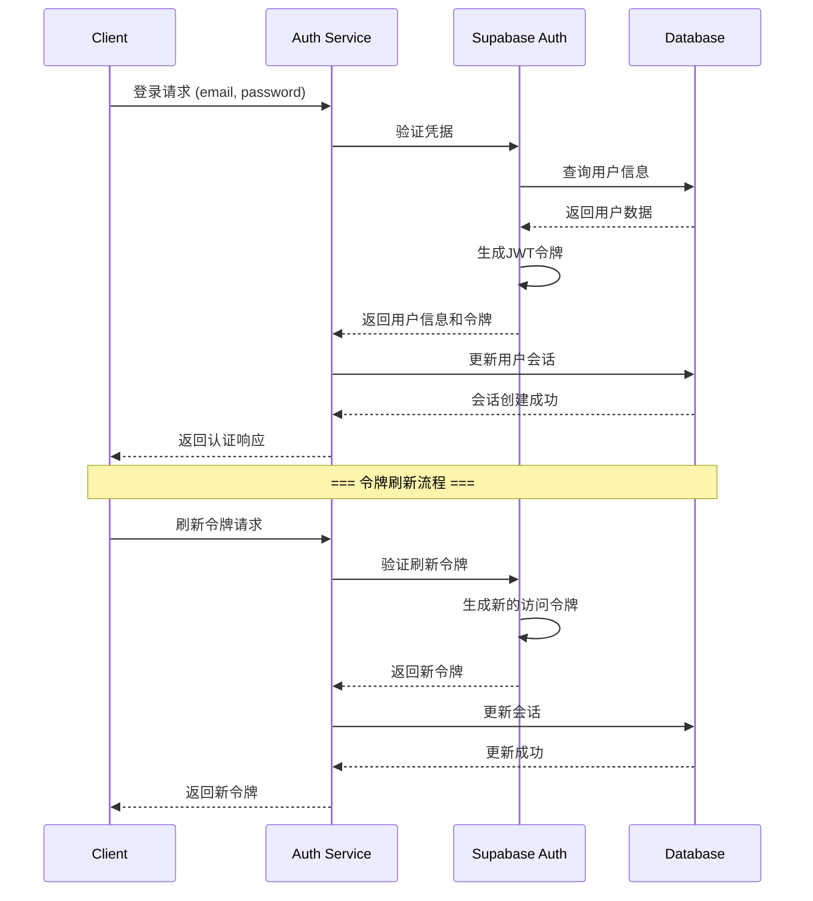
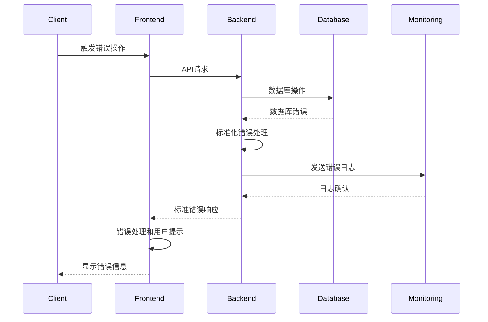

我将为您生成完整的架构文档。由于内容较长，我将以一个完整的Markdown文档形式呈现，您可以复制保存为文件。

```markdown
# 智能工作记录与总结小工具 Fullstack Architecture Document

## 1. Introduction

This document outlines the complete fullstack architecture for 智能工作记录与总结小工具, including backend systems, frontend implementation, and their integration. It serves as the single source of truth for AI-driven development, ensuring consistency across the entire technology stack.

This unified approach combines what would traditionally be separate backend and frontend architecture documents, streamlining the development process for modern fullstack applications where these concerns are increasingly intertwined.

### Starter Template or Existing Project
N/A - Greenfield project

### Change Log
| Date | Version | Description | Author |
|------|---------|-------------|--------|
| [Current Date] | 1.0 | Initial fullstack architecture creation | Winston (Architect) |

## 2. High Level Architecture

### Technical Summary
本系统采用现代化的全栈架构，基于Next.js App Router构建，结合Supabase作为后端即服务（BaaS）平台。前端使用React和Chakra UI实现响应式用户界面，后端通过Next.js API Routes提供RESTful API服务。系统采用Jamstack架构模式，实现高性能、可扩展性和安全性。通过Vercel AI SDK集成多个AI服务提供商，支持智能工作记录总结功能。整体架构设计注重用户体验、开发效率和运维便利性，完全满足PRD中定义的功能和非功能性需求。

### Platform and Infrastructure Choice
**Platform:** Vercel + Supabase
**Key Services:** Vercel (前端部署、边缘网络、函数计算), Supabase (PostgreSQL数据库、认证、实时功能、存储), Vercel AI SDK (AI服务集成)
**Deployment Host and Regions:** Vercel全球边缘网络，Supabase多区域部署（根据用户地理位置选择最近的区域）

**选择理由：**
- **开发效率**：Vercel和Supabase提供开箱即用的解决方案，大幅减少基础设施配置时间
- **技术栈一致性**：与PRD中指定的Next.js、Supabase、Vercel AI SDK完美匹配
- **成本效益**：免费层和按需付费模式，适合项目初期和成长阶段
- **可扩展性**：Vercel的边缘网络和Supabase的自动扩展能力支持业务增长
- **维护简便**：托管服务减少运维负担，团队可专注于业务逻辑开发

### Repository Structure
**Structure:** Monorepo
**Monorepo Tool:** Turborepo
**Package Organization:** 
- `apps/` 包含前端应用和API服务
- `packages/` 包含共享类型、工具和UI组件
- `infrastructure/` 包含基础设施即代码配置
- `docs/` 包含项目文档

**选择理由：**
- **代码共享**：前端和后端可以共享TypeScript类型和工具函数
- **依赖管理**：统一管理依赖版本，避免冲突
- **开发体验**：单个仓库中同时开发前端和后端，提高协作效率
- **构建优化**：Turborepo支持并行构建和智能缓存，提升构建速度

### High Level Architecture Diagram


### Architectural Patterns
- **Jamstack Architecture:** 静态站点生成与无服务器API结合 - _Rationale:_ 为内容密集型应用提供最佳性能和可扩展性
- **组件化UI:** 可复用的React组件与TypeScript - _Rationale:_ 在大型代码库中保持可维护性和类型安全
- **Repository Pattern:** 抽象数据访问逻辑 - _Rationale:_ 支持测试和未来数据库迁移的灵活性
- **API Gateway Pattern:** 所有API调用的单一入口点 - _Rationale:_ 集中化认证、速率限制和监控
- **CQRS模式:** 读写操作分离 - _Rationale:_ 优化查询性能和复杂业务逻辑处理
- **事件驱动架构:** 使用Supabase Realtime进行实时更新 - _Rationale:_ 提供实时用户体验和系统解耦
- **微前端架构:** 模块化前端组件 - _Rationale:_ 支持独立开发和部署功能模块

## 3. Tech Stack

### Technology Stack Table

| Category | Technology | Version | Purpose | Rationale |
|----------|------------|---------|---------|-----------|
| Frontend Language | TypeScript | 5.0+ | 类型安全的JavaScript开发 | 提供静态类型检查，提高代码质量和开发效率，与React完美集成 |
| Frontend Framework | Next.js | 14+ | React全栈框架 | App Router提供最佳性能和SEO，支持SSR/SSG，与Vercel部署无缝集成 |
| UI Component Library | Chakra UI | 2.8+ | 可访问的UI组件库 | 提供开箱即用的可访问组件，支持主题定制，与Tailwind CSS兼容 |
| State Management | React Query (TanStack Query) | 5.0+ | 服务器状态管理 | 优化数据获取、缓存和同步，简化API调用逻辑，提供自动重试和缓存策略 |
| Backend Language | TypeScript | 5.0+ | 类型安全的后端开发 | 与前端共享类型定义，确保API接口类型安全 |
| Backend Framework | Next.js API Routes | 14+ | 无服务器API服务 | 与前端共享代码库，简化部署，自动扩展，支持边缘函数 |
| API Style | RESTful API | - | 标准化API接口 | 简单直观，广泛支持，易于理解和实现，适合CRUD操作 |
| Database | Supabase (PostgreSQL) | 15+ | 关系型数据库服务 | 提供完整的PostgreSQL功能，实时功能，自动扩展，内置认证和存储 |
| Cache | Redis (via Supabase) | 7+ | 内存数据缓存 | 提高性能，减少数据库负载，支持会话存储和实时数据 |
| File Storage | Supabase Storage | - | 文件存储服务 | 与数据库集成，提供安全的文件上传、下载和CDN加速 |
| Authentication | Supabase Auth | - | 用户认证和授权 | 开箱即用的认证功能，支持多种提供商，JWT令牌管理 |
| Frontend Testing | Jest + React Testing Library | 29+ | 前端单元和集成测试 | Jest提供测试框架，RTL提供React组件测试，确保UI组件质量 |
| Backend Testing | Jest + Supertest | 29+ | 后端API测试 | Jest提供测试框架，Supertest简化HTTP请求测试 |
| E2E Testing | Playwright | 1.40+ | 端到端测试 | 跨浏览器测试，支持现代Web应用，提供可靠的用户流程测试 |
| Build Tool | Turborepo | 1.11+ | Monorepo构建工具 | 高效的并行构建，智能缓存，简化monorepo管理 |
| Bundler | Next.js (Webpack) | 内置 | 模块打包和代码分割 | Next.js内置优化的Webpack配置，支持代码分割和Tree Shaking |
| IaC Tool | Terraform | 1.6+ | 基础设施即代码 | 管理云资源，版本控制基础设施，支持多云部署 |
| CI/CD | GitHub Actions | - | 持续集成和部署 | 与GitHub深度集成，支持自动化测试和部署，免费额度充足 |
| Monitoring | Vercel Analytics + Sentry | - | 应用性能监控和错误跟踪 | Vercel提供内置分析，Sentry提供详细的错误报告和性能监控 |
| Logging | Winston + Supabase Logs | 3.11+ | 应用日志管理 | Winston提供结构化日志，Supabase提供集中式日志存储和查询 |
| CSS Framework | Tailwind CSS | 3.4+ | 实用优先的CSS框架 | 与Chakra UI完美集成，提供快速样式开发，统一sm尺寸规范 |

## 4. Data Models

### User
**Purpose:** 存储用户账户信息、认证数据和用户偏好设置

**Key Attributes:**
- id: UUID - 用户唯一标识符
- email: string - 用户邮箱地址
- name: string - 用户显示名称
- avatar_url: string - 用户头像URL
- created_at: timestamp - 账户创建时间
- updated_at: timestamp - 最后更新时间
- preferences: jsonb - 用户偏好设置（主题、语言、通知等）

#### TypeScript Interface
```typescript
interface User {
  id: string;
  email: string;
  name: string;
  avatar_url?: string;
  created_at: string;
  updated_at: string;
  preferences: {
    theme: 'light' | 'dark' | 'system';
    language: string;
    notifications: {
      email: boolean;
      push: boolean;
    };
    ai_settings: {
      default_provider: string;
      summary_length: 'short' | 'medium' | 'long';
    };
  };
}
```

#### Relationships
- 一个用户可以有多个工作记录（一对多）
- 一个用户可以有多个总结（一对多）
- 一个用户可以配置多个AI服务（一对多）
- 一个用户可以创建多个提示模板（一对多）

### WorkRecord
**Purpose:** 存储用户的工作记录内容，包括标题、正文、标签和时间信息

**Key Attributes:**
- id: UUID - 工作记录唯一标识符
- user_id: UUID - 关联用户ID
- title: string - 工作记录标题
- content: text - 工作记录内容（支持Markdown）
- tags: string[] - 标签数组
- created_at: timestamp - 创建时间
- updated_at: timestamp - 最后更新时间
- is_pinned: boolean - 是否置顶
- metadata: jsonb - 元数据（字数、阅读时间等）

#### TypeScript Interface
```typescript
interface WorkRecord {
  id: string;
  user_id: string;
  title: string;
  content: string;
  tags: string[];
  created_at: string;
  updated_at: string;
  is_pinned: boolean;
  metadata: {
    word_count: number;
    reading_time: number;
    source: 'manual' | 'import' | 'quick';
  };
}
```

#### Relationships
- 属于一个用户（多对一）
- 一个工作记录可以有多个总结（一对多）
- 关联多个标签（多对多，通过标签关联表）

### Tag
**Purpose:** 存储标签信息，用于分类和组织工作记录

**Key Attributes:**
- id: UUID - 标签唯一标识符
- user_id: UUID - 创建用户ID
- name: string - 标签名称
- color: string - 标签颜色
- created_at: timestamp - 创建时间
- usage_count: integer - 使用次数

#### TypeScript Interface
```typescript
interface Tag {
  id: string;
  user_id: string;
  name: string;
  color: string;
  created_at: string;
  usage_count: number;
}
```

#### Relationships
- 属于一个用户（多对一）
- 可以关联多个工作记录（多对多）

### Summary
**Purpose:** 存储AI生成的工作总结，包括原始内容、总结结果和质量评估

**Key Attributes:**
- id: UUID - 总结唯一标识符
- user_id: UUID - 用户ID
- work_record_ids: UUID[] - 关联的工作记录ID数组
- content: text - 总结内容
- ai_provider: string - AI服务提供商
- model: string - 使用的AI模型
- prompt_template_id: UUID - 使用的提示模板ID
- quality_score: number - 质量评分（0-100）
- created_at: timestamp - 创建时间
- metadata: jsonb - 元数据（token使用、生成时间等）

#### TypeScript Interface
```typescript
interface Summary {
  id: string;
  user_id: string;
  work_record_ids: string[];
  content: string;
  ai_provider: 'openai' | 'gemini' | 'deepseek' | 'custom';
  model: string;
  prompt_template_id?: string;
  quality_score: number;
  created_at: string;
  metadata: {
    tokens_used: number;
    generation_time: number;
    cost: number;
  };
}
```

#### Relationships
- 属于一个用户（多对一）
- 关联多个工作记录（多对多）
- 可能使用一个提示模板（多对一）

### AIService
**Purpose:** 存储用户配置的AI服务提供商信息

**Key Attributes:**
- id: UUID - 服务配置唯一标识符
- user_id: UUID - 用户ID
- provider: string - 服务提供商名称
- api_key: string - 加密的API密钥
- base_url: string - 自定义API基础URL（可选）
- model: string - 默认模型
- is_active: boolean - 是否启用
- created_at: timestamp - 创建时间
- updated_at: timestamp - 最后更新时间

#### TypeScript Interface
```typescript
interface AIService {
  id: string;
  user_id: string;
  provider: 'openai' | 'gemini' | 'deepseek' | 'custom';
  api_key: string; // 加密存储
  base_url?: string;
  model: string;
  is_active: boolean;
  created_at: string;
  updated_at: string;
}
```

#### Relationships
- 属于一个用户（多对一）

### PromptTemplate
**Purpose:** 存储用户创建的AI提示模板

**Key Attributes:**
- id: UUID - 模板唯一标识符
- user_id: UUID - 创建用户ID
- name: string - 模板名称
- description: string - 模板描述
- template: text - 提示模板内容
- variables: jsonb - 模板变量定义
- is_public: boolean - 是否公开分享
- created_at: timestamp - 创建时间
- updated_at: timestamp - 最后更新时间

#### TypeScript Interface
```typescript
interface PromptTemplate {
  id: string;
  user_id: string;
  name: string;
  description: string;
  template: string;
  variables: {
    name: string;
    type: string;
    required: boolean;
    default?: string;
  }[];
  is_public: boolean;
  created_at: string;
  updated_at: string;
}
```

#### Relationships
- 属于一个用户（多对一）
- 被多个总结使用（一对多）

### Export
**Purpose:** 存储导出历史记录

**Key Attributes:**
- id: UUID - 导出记录唯一标识符
- user_id: UUID - 用户ID
- type: string - 导出类型（PDF、CSV、JSON等）
- filter: jsonb - 导出筛选条件
- file_url: string - 导出文件URL
- file_size: integer - 文件大小（字节）
- status: string - 导出状态
- created_at: timestamp - 创建时间
- completed_at: timestamp - 完成时间

#### TypeScript Interface
```typescript
interface Export {
  id: string;
  user_id: string;
  type: 'pdf' | 'csv' | 'json' | 'markdown';
  filter: {
    date_range: {
      start: string;
      end: string;
    };
    tags?: string[];
    include_summaries: boolean;
  };
  file_url?: string;
  file_size?: number;
  status: 'pending' | 'processing' | 'completed' | 'failed';
  created_at: string;
  completed_at?: string;
}
```

#### Relationships
- 属于一个用户（多对一）

## 5. API Specification

### REST API Specification

```yaml
openapi: 3.0.0
info:
  title: 智能工作记录与总结小工具 API
  version: 1.0.0
  description: 智能工作记录与总结小工具的RESTful API，支持工作记录管理、AI总结生成、数据分析等功能
servers:
  - url: https://api.example.com/v1
    description: Production server
  - url: https://dev-api.example.com/v1
    description: Development server

paths:
  # Authentication endpoints
  /auth/register:
    post:
      summary: 用户注册
      tags: [Authentication]
      requestBody:
        required: true
        content:
          application/json:
            schema:
              type: object
              required: [email, password, name]
              properties:
                email:
                  type: string
                  format: email
                password:
                  type: string
                  minLength: 8
                name:
                  type: string
                  minLength: 2
      responses:
        '201':
          description: 注册成功
          content:
            application/json:
              schema:
                type: object
                properties:
                  user:
                    $ref: '#/components/schemas/User'
                  session:
                    type: object
                    properties:
                      access_token:
                        type: string
                      refresh_token:
                        type: string
        '400':
          $ref: '#/components/responses/BadRequest'
        '409':
          description: 邮箱已存在

  /auth/login:
    post:
      summary: 用户登录
      tags: [Authentication]
      requestBody:
        required: true
        content:
          application/json:
            schema:
              type: object
              required: [email, password]
              properties:
                email:
                  type: string
                  format: email
                password:
                  type: string
      responses:
        '200':
          description: 登录成功
          content:
            application/json:
              schema:
                type: object
                properties:
                  user:
                    $ref: '#/components/schemas/User'
                  session:
                    type: object
                    properties:
                      access_token:
                        type: string
                      refresh_token:
                        type: string
        '401':
          $ref: '#/components/responses/Unauthorized'

  # WorkRecord endpoints
  /work-records:
    get:
      summary: 获取工作记录列表
      tags: [Work Records]
      security:
        - bearerAuth: []
      parameters:
        - name: page
          in: query
          schema:
            type: integer
            default: 1
        - name: limit
          in: query
          schema:
            type: integer
            default: 20
            maximum: 100
        - name: tags
          in: query
          schema:
            type: string
            description: 标签过滤，多个标签用逗号分隔
        - name: date_from
          in: query
          schema:
            type: string
            format: date
        - name: date_to
          in: query
          schema:
            type: string
            format: date
        - name: search
          in: query
          schema:
            type: string
            description: 搜索关键词
      responses:
        '200':
          description: 成功获取工作记录列表
          content:
            application/json:
              schema:
                type: object
                properties:
                  data:
                    type: array
                    items:
                      $ref: '#/components/schemas/WorkRecord'
                  pagination:
                    type: object
                    properties:
                      page:
                        type: integer
                      limit:
                        type: integer
                      total:
                        type: integer
                      pages:
                        type: integer

    post:
      summary: 创建工作记录
      tags: [Work Records]
      security:
        - bearerAuth: []
      requestBody:
        required: true
        content:
          application/json:
            schema:
              $ref: '#/components/schemas/CreateWorkRecord'
      responses:
        '201':
          description: 创建成功
          content:
            application/json:
              schema:
                $ref: '#/components/schemas/WorkRecord'

  /work-records/{id}:
    get:
      summary: 获取工作记录详情
      tags: [Work Records]
      security:
        - bearerAuth: []
      parameters:
        - name: id
          in: path
          required: true
          schema:
            type: string
            format: uuid
      responses:
        '200':
          description: 成功获取工作记录
          content:
            application/json:
              schema:
                $ref: '#/components/schemas/WorkRecord'
        '404':
          $ref: '#/components/responses/NotFound'

    put:
      summary: 更新工作记录
      tags: [Work Records]
      security:
        - bearerAuth: []
      parameters:
        - name: id
          in: path
          required: true
          schema:
            type: string
            format: uuid
      requestBody:
        required: true
        content:
          application/json:
            schema:
              $ref: '#/components/schemas/UpdateWorkRecord'
      responses:
        '200':
          description: 更新成功
          content:
            application/json:
              schema:
                $ref: '#/components/schemas/WorkRecord'

    delete:
      summary: 删除工作记录
      tags: [Work Records]
      security:
        - bearerAuth: []
      parameters:
        - name: id
          in: path
          required: true
          schema:
            type: string
            format: uuid
      responses:
        '204':
          description: 删除成功

  # Summary endpoints
  /summaries:
    get:
      summary: 获取总结列表
      tags: [Summaries]
      security:
        - bearerAuth: []
      parameters:
        - name: page
          in: query
          schema:
            type: integer
            default: 1
        - name: limit
          in: query
          schema:
            type: integer
            default: 20
            maximum: 100
        - name: work_record_ids
          in: query
          schema:
            type: string
            description: 工作记录ID过滤，多个ID用逗号分隔
      responses:
        '200':
          description: 成功获取总结列表
          content:
            application/json:
              schema:
                type: object
                properties:
                  data:
                    type: array
                    items:
                      $ref: '#/components/schemas/Summary'
                  pagination:
                    type: object
                    properties:
                      page:
                        type: integer
                      limit:
                        type: integer
                      total:
                        type: integer
                      pages:
                        type: integer

    post:
      summary: 生成AI总结
      tags: [Summaries]
      security:
        - bearerAuth: []
      requestBody:
        required: true
        content:
          application/json:
            schema:
              $ref: '#/components/schemas/CreateSummary'
      responses:
        '201':
          description: 总结生成成功
          content:
            application/json:
              schema:
                $ref: '#/components/schemas/Summary'
        '400':
          $ref: '#/components/responses/BadRequest'
        '503':
          description: AI服务暂时不可用

  /summaries/{id}:
    get:
      summary: 获取总结详情
      tags: [Summaries]
      security:
        - bearerAuth: []
      parameters:
        - name: id
          in: path
          required: true
          schema:
            type: string
            format: uuid
      responses:
        '200':
          description: 成功获取总结
          content:
            application/json:
              schema:
                $ref: '#/components/schemas/Summary'
        '404':
          $ref: '#/components/responses/NotFound'

  # Tag endpoints
  /tags:
    get:
      summary: 获取标签列表
      tags: [Tags]
      security:
        - bearerAuth: []
      parameters:
        - name: search
          in: query
          schema:
            type: string
        - name: sort
          in: query
          schema:
            type: string
            enum: [name, usage_count, created_at]
            default: usage_count
        - name: order
          in: query
          schema:
            type: string
            enum: [asc, desc]
            default: desc
      responses:
        '200':
          description: 成功获取标签列表
          content:
            application/json:
              schema:
                type: array
                items:
                  $ref: '#/components/schemas/Tag'

    post:
      summary: 创建标签
      tags: [Tags]
      security:
        - bearerAuth: []
      requestBody:
        required: true
        content:
          application/json:
            schema:
              type: object
              required: [name, color]
              properties:
                name:
                  type: string
                  minLength: 1
                color:
                  type: string
                  pattern: ^#[0-9A-Fa-f]{6}$
      responses:
        '201':
          description: 创建成功
          content:
            application/json:
              schema:
                $ref: '#/components/schemas/Tag'

  # AI Service endpoints
  /ai-services:
    get:
      summary: 获取AI服务配置列表
      tags: [AI Services]
      security:
        - bearerAuth: []
      responses:
        '200':
          description: 成功获取AI服务列表
          content:
            application/json:
              schema:
                type: array
                items:
                  $ref: '#/components/schemas/AIService'

    post:
      summary: 添加AI服务配置
      tags: [AI Services]
      security:
        - bearerAuth: []
      requestBody:
        required: true
        content:
          application/json:
            schema:
              $ref: '#/components/schemas/CreateAIService'
      responses:
        '201':
          description: 添加成功
          content:
            application/json:
              schema:
                $ref: '#/components/schemas/AIService'

  /ai-services/{id}:
    put:
      summary: 更新AI服务配置
      tags: [AI Services]
      security:
        - bearerAuth: []
      parameters:
        - name: id
          in: path
          required: true
          schema:
            type: string
            format: uuid
      requestBody:
        required: true
        content:
          application/json:
            schema:
              $ref: '#/components/schemas/UpdateAIService'
      responses:
        '200':
          description: 更新成功
          content:
            application/json:
              schema:
                $ref: '#/components/schemas/AIService'

  # Analytics endpoints
  /analytics/trends:
    get:
      summary: 获取工作趋势分析
      tags: [Analytics]
      security:
        - bearerAuth: []
      parameters:
        - name: period
          in: query
          schema:
            type: string
            enum: [day, week, month, year]
            default: week
        - name: date_from
          in: query
          schema:
            type: string
            format: date
        - name: date_to
          in: query
          schema:
            type: string
            format: date
      responses:
        '200':
          description: 成功获取趋势数据
          content:
            application/json:
              schema:
                type: object
                properties:
                  labels:
                    type: array
                    items:
                      type: string
                  datasets:
                    type: array
                    items:
                      type: object
                      properties:
                        label:
                          type: string
                        data:
                          type: array
                          items:
                            type: number
                        borderColor:
                          type: string
                        backgroundColor:
                          type: string

  /analytics/time-distribution:
    get:
      summary: 获取时间分布分析
      tags: [Analytics]
      security:
        - bearerAuth: []
      parameters:
        - name: period
          in: query
          schema:
            type: string
            enum: [day, week, month]
            default: week
      responses:
        '200':
          description: 成功获取时间分布数据
          content:
            application/json:
              schema:
                type: object
                properties:
                  heatmap:
                    type: array
                    items:
                      type: object
                      properties:
                        hour:
                          type: integer
                        day:
                          type: integer
                        value:
                          type: number

  # Export endpoints
  /exports:
    post:
      summary: 创建导出任务
      tags: [Exports]
      security:
        - bearerAuth: []
      requestBody:
        required: true
        content:
          application/json:
            schema:
              $ref: '#/components/schemas/CreateExport'
      responses:
        '201':
          description: 导出任务创建成功
          content:
            application/json:
              schema:
                $ref: '#/components/schemas/Export'

  /exports/{id}:
    get:
      summary: 获取导出任务状态
      tags: [Exports]
      security:
        - bearerAuth: []
      parameters:
        - name: id
          in: path
          required: true
          schema:
            type: string
            format: uuid
      responses:
        '200':
          description: 成功获取导出任务
          content:
            application/json:
              schema:
                $ref: '#/components/schemas/Export'

components:
  securitySchemes:
    bearerAuth:
      type: http
      scheme: bearer
      bearerFormat: JWT

  schemas:
    User:
      type: object
      properties:
        id:
          type: string
          format: uuid
        email:
          type: string
          format: email
        name:
          type: string
        avatar_url:
          type: string
          nullable: true
        created_at:
          type: string
          format: date-time
        updated_at:
          type: string
          format: date-time
        preferences:
          type: object
          properties:
            theme:
              type: string
              enum: [light, dark, system]
            language:
              type: string
            notifications:
              type: object
              properties:
                email:
                  type: boolean
                push:
                  type: boolean
            ai_settings:
              type: object
              properties:
                default_provider:
                  type: string
                summary_length:
                  type: string
                  enum: [short, medium, long]

    WorkRecord:
      type: object
      properties:
        id:
          type: string
          format: uuid
        user_id:
          type: string
          format: uuid
        title:
          type: string
        content:
          type: string
        tags:
          type: array
          items:
            type: string
        created_at:
          type: string
          format: date-time
        updated_at:
          type: string
          format: date-time
        is_pinned:
          type: boolean
        metadata:
          type: object
          properties:
            word_count:
              type: integer
            reading_time:
              type: integer
            source:
              type: string
              enum: [manual, import, quick]

    CreateWorkRecord:
      type: object
      required: [title, content]
      properties:
        title:
          type: string
        content:
          type: string
        tags:
          type: array
          items:
            type: string
        is_pinned:
          type: boolean
          default: false

    UpdateWorkRecord:
      type: object
      properties:
        title:
          type: string
        content:
          type: string
        tags:
          type: array
          items:
            type: string
        is_pinned:
          type: boolean

    Summary:
      type: object
      properties:
        id:
          type: string
          format: uuid
        user_id:
          type: string
          format: uuid
        work_record_ids:
          type: array
          items:
            type: string
            format: uuid
        content:
          type: string
        ai_provider:
          type: string
          enum: [openai, gemini, deepseek, custom]
        model:
          type: string
        prompt_template_id:
          type: string
          format: uuid
          nullable: true
        quality_score:
          type: number
          minimum: 0
          maximum: 100
        created_at:
          type: string
          format: date-time
        metadata:
          type: object
          properties:
            tokens_used:
              type: integer
            generation_time:
              type: integer
            cost:
              type: number

    CreateSummary:
      type: object
      required: [work_record_ids, ai_provider, model]
      properties:
        work_record_ids:
          type: array
          items:
            type: string
            format: uuid
        ai_provider:
          type: string
          enum: [openai, gemini, deepseek, custom]
        model:
          type: string
        prompt_template_id:
          type: string
          format: uuid
        summary_length:
          type: string
          enum: [short, medium, long]
          default: medium

    Tag:
      type: object
      properties:
        id:
          type: string
          format: uuid
        user_id:
          type: string
          format: uuid
        name:
          type: string
        color:
          type: string
          pattern: ^#[0-9A-Fa-f]{6}$
        created_at:
          type: string
          format: date-time
        usage_count:
          type: integer
          minimum: 0

    AIService:
      type: object
      properties:
        id:
          type: string
          format: uuid
        user_id:
          type: string
          format: uuid
        provider:
          type: string
          enum: [openai, gemini, deepseek, custom]
        base_url:
          type: string
          nullable: true
        model:
          type: string
        is_active:
          type: boolean
        created_at:
          type: string
          format: date-time
        updated_at:
          type: string
          format: date-time

    CreateAIService:
      type: object
      required: [provider, api_key, model]
      properties:
        provider:
          type: string
          enum: [openai, gemini, deepseek, custom]
        api_key:
          type: string
        base_url:
          type: string
        model:
          type: string
        is_active:
          type: boolean
          default: true

    UpdateAIService:
      type: object
      properties:
        api_key:
          type: string
        base_url:
          type: string
        model:
          type: string
        is_active:
          type: boolean

    Export:
      type: object
      properties:
        id:
          type: string
          format: uuid
        user_id:
          type: string
          format: uuid
        type:
          type: string
          enum: [pdf, csv, json, markdown]
        filter:
          type: object
          properties:
            date_range:
              type: object
              properties:
                start:
                  type: string
                  format: date
                end:
                  type: string
                  format: date
            tags:
              type: array
              items:
                type: string
            include_summaries:
              type: boolean
        file_url:
          type: string
          nullable: true
        file_size:
          type: integer
          nullable: true
        status:
          type: string
          enum: [pending, processing, completed, failed]
        created_at:
          type: string
          format: date-time
        completed_at:
          type: string
          format: date-time
          nullable: true

    CreateExport:
      type: object
      required: [type, filter]
      properties:
        type:
          type: string
          enum: [pdf, csv, json, markdown]
        filter:
          type: object
          properties:
            date_range:
              type: object
              properties:
                start:
                  type: string
                  format: date
                end:
                  type: string
                  format: date
            tags:
              type: array
              items:
                type: string
            include_summaries:
              type: boolean

  responses:
    BadRequest:
      description: 请求参数错误
      content:
        application/json:
          schema:
            type: object
            properties:
              error:
                type: object
                properties:
                  code:
                    type: string
                  message:
                    type: string
                  details:
                    type: object

    Unauthorized:
      description: 未授权访问
      content:
        application/json:
          schema:
            type: object
            properties:
              error:
                type: object
                properties:
                  code:
                    type: string
                  message:
                    type: string

    NotFound:
      description: 资源未找到
      content:
        application/json:
          schema:
            type: object
            properties:
              error:
                type: object
                properties:
                  code:
                    type: string
                  message:
                    type: string
```

## 6. Components

### Frontend Application
**Responsibility:** 提供用户界面，处理用户交互，管理前端状态，与后端API通信

**Key Interfaces:**
- REST API客户端接口
- React组件接口
- 状态管理接口
- 路由导航接口

**Dependencies:** Next.js, React, Chakra UI, React Query, Zustand (或React Context)

**Technology Stack:** TypeScript, Next.js 14+, React 18+, Chakra UI 2.8+, React Query 5.0+, Tailwind CSS 3.4+

### Backend API Service
**Responsibility:** 处理HTTP请求，实现业务逻辑，管理数据访问，提供RESTful API

**Key Interfaces:**
- REST API端点
- 数据库访问接口
- 认证中间件
- 错误处理接口

**Dependencies:** Next.js API Routes, Supabase, Drizzle ORM, JWT

**Technology Stack:** TypeScript, Next.js 14+, Supabase (PostgreSQL), Drizzle ORM, jsonwebtoken

### AI Service Integration
**Responsibility:** 管理与多个AI服务提供商的集成，处理AI请求和响应，提供统一的AI服务接口

**Key Interfaces:**
- AI服务提供商接口
- 提示模板接口
- 总结生成接口
- 质量评估接口

**Dependencies:** Vercel AI SDK, OpenAI API, Gemini API, DeepSeek API

**Technology Stack:** TypeScript, Vercel AI SDK, OpenAI, Google AI, DeepSeek SDK

### Data Management Service
**Responsibility:** 管理数据模型，处理数据验证，实现数据访问层，提供数据同步功能

**Key Interfaces:**
- 数据模型接口
- 数据验证接口
- 数据同步接口
- 缓存接口

**Dependencies:** Drizzle ORM, Supabase, Redis (通过Supabase)

**Technology Stack:** TypeScript, Drizzle ORM, Supabase, Zod (数据验证)

### Authentication Service
**Responsibility:** 处理用户认证和授权，管理JWT令牌，实现权限控制

**Key Interfaces:**
- 用户认证接口
- 令牌管理接口
- 权限验证接口
- 会话管理接口

**Dependencies:** Supabase Auth, JWT, Next.js Middleware

**Technology Stack:** TypeScript, Supabase Auth, jsonwebtoken, Next.js Middleware

### Real-time Sync Service
**Responsibility:** 实现实时数据同步，管理WebSocket连接，处理实时事件

**Key Interfaces:**
- 实时事件接口
- WebSocket连接接口
- 数据同步接口
- 离线同步接口

**Dependencies:** Supabase Realtime, WebSocket API

**Technology Stack:** TypeScript, Supabase Realtime, WebSocket API

### File Storage Service
**Responsibility:** 管理文件上传、下载和存储，处理文件格式转换，提供CDN加速

**Key Interfaces:**
- 文件上传接口
- 文件下载接口
- 文件管理接口
- CDN接口

**Dependencies:** Supabase Storage, Vercel Blob (可选)

**Technology Stack:** TypeScript, Supabase Storage, Multer (文件处理)

### Analytics Service
**Responsibility:** 收集和分析用户数据，生成统计报告，提供数据可视化支持

**Key Interfaces:**
- 数据收集接口
- 分析计算接口
- 报告生成接口
- 可视化数据接口

**Dependencies:** Recharts/Chart.js, Drizzle ORM, Supabase

**Technology Stack:** TypeScript, Recharts 2.8+, Drizzle ORM, Supabase

### Export Service
**Responsibility:** 处理数据导出请求，生成各种格式的导出文件，管理导出任务队列

**Key Interfaces:**
- 导出任务接口
- 文件生成接口
- 格式转换接口
- 队列管理接口

**Dependencies:** PDFKit, CSV-Stringify, JS-YAML, Bull (队列)

**Technology Stack:** TypeScript, PDFKit, csv-stringify, js-yaml, Bull (队列)

### Notification Service
**Responsibility:** 管理用户通知，处理邮件和推送通知，提供通知模板

**Key Interfaces:**
- 通知发送接口
- 通知模板接口
- 用户偏好接口
- 队列管理接口

**Dependencies:** Nodemailer (邮件), Web Push API, Supabase

**Technology Stack:** TypeScript, Nodemailer, Web Push API, Supabase

### Component Diagrams



## 7. External APIs

### OpenAI API
- **Purpose:** 提供GPT模型进行工作记录的智能总结和内容分析
- **Documentation:** https://platform.openai.com/docs/api-reference
- **Base URL(s):** https://api.openai.com/v1
- **Authentication:** Bearer Token (API Key)
- **Rate Limits:** 
  - Free tier: 20 requests per minute, 200,000 tokens per minute
  - Paid tier: 3,500 requests per minute, 350,000 tokens per minute

**Key Endpoints Used:**
- `POST /chat/completions` - 生成对话完成（用于工作总结）
- `POST /embeddings` - 生成文本嵌入（用于语义搜索）
- `GET /models` - 获取可用模型列表

**Integration Notes:** 使用Vercel AI SDK进行集成，支持流式响应和错误重试。需要处理API密钥的安全存储和轮换。

### Gemini API
- **Purpose:** 提供Google的Gemini模型进行多模态内容理解和总结
- **Documentation:** https://ai.google.dev/docs
- **Base URL(s):** https://generativelanguage.googleapis.com/v1
- **Authentication:** API Key
- **Rate Limits:** 60 requests per minute

**Key Endpoints Used:**
- `POST /models/{model}:generateContent` - 生成内容（用于工作总结）
- `POST /models/{model}:countTokens` - 计算token数量
- `POST /models/{model}:embedContent` - 生成内容嵌入

**Integration Notes:** 需要处理多模态输入（文本、图片），支持流式响应。注意不同模型的特性和限制。

### DeepSeek API
- **Purpose:** 提供DeepSeek模型进行中文内容优化和专业领域总结
- **Documentation:** https://platform.deepseek.com/api-docs
- **Base URL(s):** https://api.deepseek.com
- **Authentication:** Bearer Token (API Key)
- **Rate Limits:** 100 requests per minute

**Key Endpoints Used:**
- `POST /chat/completions` - 生成对话完成
- `POST /embeddings` - 生成文本嵌入
- `GET /models` - 获取模型列表

**Integration Notes:** 专门优化中文内容处理，支持长文本处理。需要注意API兼容性和错误处理。

### Supabase Auth API
- **Purpose:** 提供用户认证、会话管理和权限控制
- **Documentation:** https://supabase.com/docs/reference/auth
- **Base URL(s):** https://{project_ref}.supabase.co/auth/v1
- **Authentication:** API Key (anon key for public, service role key for admin)
- **Rate Limits:** 30 requests per second per IP

**Key Endpoints Used:**
- `POST /signup` - 用户注册
- `POST /token?grant_type=password` - 用户登录
- `POST /token?grant_type=refresh_token` - 刷新令牌
- `POST /logout` - 用户登出
- `GET /user` - 获取当前用户信息

**Integration Notes:** 使用Supabase JS客户端进行集成，支持JWT令牌管理和会话持久化。

### Supabase Storage API
- **Purpose:** 提供文件存储、上传和CDN加速服务
- **Documentation:** https://supabase.com/docs/reference/storage
- **Base URL(s):** https://{project_ref}.supabase.co/storage/v1
- **Authentication:** API Key + JWT Token
- **Rate Limits:** 100 requests per second per IP

**Key Endpoints Used:**
- `POST /object/{bucket_name}` - 上传文件
- `GET /object/{bucket_name}/{file_path}` - 下载文件
- `DELETE /object/{bucket_name}/{file_path}` - 删除文件
- `POST /object/{bucket_name}/move` - 移动文件
- `POST /object/{bucket_name}/copy` - 复制文件

**Integration Notes:** 支持大文件分片上传，自动生成CDN URL，支持文件权限管理。

### Supabase Realtime API
- **Purpose:** 提供实时数据同步和WebSocket连接
- **Documentation:** https://supabase.com/docs/reference/realtime
- **Base URL(s):** wss://{project_ref}.supabase.co/realtime/v1
- **Authentication:** JWT Token
- **Rate Limits:** 100 connections per client

**Key Endpoints Used:**
- `WebSocket /realtime/v1` - 建立实时连接
- `POST /realtime/v1/subscribe` - 订阅数据变更
- `POST /realtime/v1/unsubscribe` - 取消订阅

**Integration Notes:** 支持数据库变更监听、广播消息和状态同步。需要处理连接重连和错误恢复。

## 8. Core Workflows

### Workflow 1: User Registration and Login


### Workflow 2: Creating a Work Record


### Workflow 3: Generating AI Summary


### Workflow 4: Real-time Data Synchronization


### Workflow 5: Data Export


## 9. Database Schema

```sql
-- 用户表
CREATE TABLE users (
    id UUID PRIMARY KEY DEFAULT gen_random_uuid(),
    email VARCHAR(255) UNIQUE NOT NULL,
    name VARCHAR(100) NOT NULL,
    avatar_url TEXT,
    created_at TIMESTAMP WITH TIME ZONE DEFAULT NOW(),
    updated_at TIMESTAMP WITH TIME ZONE DEFAULT NOW(),
    preferences JSONB DEFAULT '{}'::jsonb
);

-- 工作记录表
CREATE TABLE work_records (
    id UUID PRIMARY KEY DEFAULT gen_random_uuid(),
    user_id UUID NOT NULL REFERENCES users(id) ON DELETE CASCADE,
    title VARCHAR(500) NOT NULL,
    content TEXT NOT NULL,
    tags TEXT[] DEFAULT '{}',
    created_at TIMESTAMP WITH TIME ZONE DEFAULT NOW(),
    updated_at TIMESTAMP WITH TIME ZONE DEFAULT NOW(),
    is_pinned BOOLEAN DEFAULT FALSE,
    metadata JSONB DEFAULT '{}'::jsonb
);

-- 标签表
CREATE TABLE tags (
    id UUID PRIMARY KEY DEFAULT gen_random_uuid(),
    user_id UUID NOT NULL REFERENCES users(id) ON DELETE CASCADE,
    name VARCHAR(100) NOT NULL,
    color VARCHAR(7) NOT NULL CHECK (color ~ '^#[0-9A-Fa-f]{6}$'),
    created_at TIMESTAMP WITH TIME ZONE DEFAULT NOW(),
    usage_count INTEGER DEFAULT 0
);

-- 工作记录-标签关联表（多对多关系）
CREATE TABLE work_record_tags (
    work_record_id UUID NOT NULL REFERENCES work_records(id) ON DELETE CASCADE,
    tag_id UUID NOT NULL REFERENCES tags(id) ON DELETE CASCADE,
    PRIMARY KEY (work_record_id, tag_id)
);

-- 总结表
CREATE TABLE summaries (
    id UUID PRIMARY KEY DEFAULT gen_random_uuid(),
    user_id UUID NOT NULL REFERENCES users(id) ON DELETE CASCADE,
    work_record_ids UUID[] NOT NULL,
    content TEXT NOT NULL,
    ai_provider VARCHAR(50) NOT NULL CHECK (ai_provider IN ('openai', 'gemini', 'deepseek', 'custom')),
    model VARCHAR(100) NOT NULL,
    prompt_template_id UUID REFERENCES prompt_templates(id) ON DELETE SET NULL,
    quality_score INTEGER CHECK (quality_score >= 0 AND quality_score <= 100),
    created_at TIMESTAMP WITH TIME ZONE DEFAULT NOW(),
    metadata JSONB DEFAULT '{}'::jsonb
);

-- 总结-工作记录关联表（多对多关系）
CREATE TABLE summary_work_records (
    summary_id UUID NOT NULL REFERENCES summaries(id) ON DELETE CASCADE,
    work_record_id UUID NOT NULL REFERENCES work_records(id) ON DELETE CASCADE,
    PRIMARY KEY (summary_id, work_record_id)
);

-- AI服务配置表
CREATE TABLE ai_services (
    id UUID PRIMARY KEY DEFAULT gen_random_uuid(),
    user_id UUID NOT NULL REFERENCES users(id) ON DELETE CASCADE,
    provider VARCHAR(50) NOT NULL CHECK (provider IN ('openai', 'gemini', 'deepseek', 'custom')),
    api_key TEXT NOT NULL, -- 加密存储
    base_url TEXT,
    model VARCHAR(100) NOT NULL,
    is_active BOOLEAN DEFAULT TRUE,
    created_at TIMESTAMP WITH TIME ZONE DEFAULT NOW(),
    updated_at TIMESTAMP WITH TIME ZONE DEFAULT NOW()
);

-- 提示模板表
CREATE TABLE prompt_templates (
    id UUID PRIMARY KEY DEFAULT gen_random_uuid(),
    user_id UUID NOT NULL REFERENCES users(id) ON DELETE CASCADE,
    name VARCHAR(200) NOT NULL,
    description TEXT,
    template TEXT NOT NULL,
    variables JSONB DEFAULT '[]'::jsonb,
    is_public BOOLEAN DEFAULT FALSE,
    created_at TIMESTAMP WITH TIME ZONE DEFAULT NOW(),
    updated_at TIMESTAMP WITH TIME ZONE DEFAULT NOW()
);

-- 导出记录表
CREATE TABLE exports (
    id UUID PRIMARY KEY DEFAULT gen_random_uuid(),
    user_id UUID NOT NULL REFERENCES users(id) ON DELETE CASCADE,
    type VARCHAR(20) NOT NULL CHECK (type IN ('pdf', 'csv', 'json', 'markdown')),
    filter JSONB NOT NULL,
    file_url TEXT,
    file_size BIGINT,
    status VARCHAR(20) NOT NULL DEFAULT 'pending' CHECK (status IN ('pending', 'processing', 'completed', 'failed')),
    created_at TIMESTAMP WITH TIME ZONE DEFAULT NOW(),
    completed_at TIMESTAMP WITH TIME ZONE
);

-- 用户会话表（用于JWT令牌管理）
CREATE TABLE user_sessions (
    id UUID PRIMARY KEY DEFAULT gen_random_uuid(),
    user_id UUID NOT NULL REFERENCES users(id) ON DELETE CASCADE,
    refresh_token TEXT NOT NULL UNIQUE,
    expires_at TIMESTAMP WITH TIME ZONE NOT NULL,
    created_at TIMESTAMP WITH TIME ZONE DEFAULT NOW(),
    device_info JSONB
);

-- 创建索引以优化查询性能
CREATE INDEX idx_work_records_user_id ON work_records(user_id);
CREATE INDEX idx_work_records_created_at ON work_records(created_at DESC);
CREATE INDEX idx_work_records_tags ON work_records USING GIN(tags);
CREATE INDEX idx_tags_user_id ON tags(user_id);
CREATE INDEX idx_tags_name ON tags(name);
CREATE INDEX idx_summaries_user_id ON summaries(user_id);
CREATE INDEX idx_summaries_created_at ON summaries(created_at DESC);
CREATE INDEX idx_ai_services_user_id ON ai_services(user_id);
CREATE INDEX idx_ai_services_provider ON ai_services(provider);
CREATE INDEX idx_prompt_templates_user_id ON prompt_templates(user_id);
CREATE INDEX idx_exports_user_id ON exports(user_id);
CREATE INDEX idx_exports_status ON exports(status);
CREATE INDEX idx_user_sessions_user_id ON user_sessions(user_id);
CREATE INDEX idx_user_sessions_refresh_token ON user_sessions(refresh_token);

-- 创建更新时间触发器
CREATE OR REPLACE FUNCTION update_updated_at_column()
RETURNS TRIGGER AS $$
BEGIN
    NEW.updated_at = NOW();
    RETURN NEW;
END;
$$ language 'plpgsql';

-- 为需要更新时间的表添加触发器
CREATE TRIGGER update_users_updated_at BEFORE UPDATE ON users FOR EACH ROW EXECUTE FUNCTION update_updated_at_column();
CREATE TRIGGER update_work_records_updated_at BEFORE UPDATE ON work_records FOR EACH ROW EXECUTE FUNCTION update_updated_at_column();
CREATE TRIGGER update_ai_services_updated_at BEFORE UPDATE ON ai_services FOR EACH ROW EXECUTE FUNCTION update_updated_at_column();
CREATE TRIGGER update_prompt_templates_updated_at BEFORE UPDATE ON prompt_templates FOR EACH ROW EXECUTE FUNCTION update_updated_at_column();

-- 创建标签使用计数更新触发器
CREATE OR REPLACE FUNCTION update_tag_usage_count()
RETURNS TRIGGER AS $$
BEGIN
    IF TG_OP = 'INSERT' THEN
        UPDATE tags SET usage_count = usage_count + 1 WHERE id = NEW.tag_id;
        RETURN NEW;
    ELSIF TG_OP = 'DELETE' THEN
        UPDATE tags SET usage_count = usage_count - 1 WHERE id = OLD.tag_id;
        RETURN OLD;
    END IF;
    RETURN NULL;
END;
$$ language 'plpgsql';

CREATE TRIGGER trigger_update_tag_usage_count
    AFTER INSERT OR DELETE ON work_record_tags
    FOR EACH ROW EXECUTE FUNCTION update_tag_usage_count();

-- 创建RLS (Row Level Security) 策略
ALTER TABLE users ENABLE ROW LEVEL SECURITY;
ALTER TABLE work_records ENABLE ROW LEVEL SECURITY;
ALTER TABLE tags ENABLE ROW LEVEL SECURITY;
ALTER TABLE summaries ENABLE ROW LEVEL SECURITY;
ALTER TABLE ai_services ENABLE ROW LEVEL SECURITY;
ALTER TABLE prompt_templates ENABLE ROW LEVEL SECURITY;
ALTER TABLE exports ENABLE ROW LEVEL SECURITY;
ALTER TABLE user_sessions ENABLE ROW LEVEL SECURITY;

-- 用户只能访问自己的数据
CREATE POLICY "Users can view own data" ON users FOR SELECT USING (auth.uid() = id);
CREATE POLICY "Users can update own data" ON users FOR UPDATE USING (auth.uid() = id);

CREATE POLICY "Users can view own work records" ON work_records FOR SELECT USING (auth.uid() = user_id);
CREATE POLICY "Users can insert own work records" ON work_records FOR INSERT WITH CHECK (auth.uid() = user_id);
CREATE POLICY "Users can update own work records" ON work_records FOR UPDATE USING (auth.uid() = user_id);
CREATE POLICY "Users can delete own work records" ON work_records FOR DELETE USING (auth.uid() = user_id);

CREATE POLICY "Users can view own tags" ON tags FOR SELECT USING (auth.uid() = user_id);
CREATE POLICY "Users can insert own tags" ON tags FOR INSERT WITH CHECK (auth.uid() = user_id);
CREATE POLICY "Users can update own tags" ON tags FOR UPDATE USING (auth.uid() = user_id);
CREATE POLICY "Users can delete own tags" ON tags FOR DELETE USING (auth.uid() = user_id);

CREATE POLICY "Users can view own summaries" ON summaries FOR SELECT USING (auth.uid() = user_id);
CREATE POLICY "Users can insert own summaries" ON summaries FOR INSERT WITH CHECK (auth.uid() = user_id);
CREATE POLICY "Users can update own summaries" ON summaries FOR UPDATE USING (auth.uid() = user_id);
CREATE POLICY "Users can delete own summaries" ON summaries FOR DELETE USING (auth.uid() = user_id);

CREATE POLICY "Users can view own AI services" ON ai_services FOR SELECT USING (auth.uid() = user_id);
CREATE POLICY "Users can insert own AI services" ON ai_services FOR INSERT WITH CHECK (auth.uid() = user_id);
CREATE POLICY "Users can update own AI services" ON ai_services FOR UPDATE USING (auth.uid() = user_id);
CREATE POLICY "Users can delete own AI services" ON ai_services FOR DELETE USING (auth.uid() = user_id);

CREATE POLICY "Users can view own prompt templates" ON prompt_templates FOR SELECT USING (auth.uid() = user_id OR is_public = true);
CREATE POLICY "Users can insert own prompt templates" ON prompt_templates FOR INSERT WITH CHECK (auth.uid() = user_id);
CREATE POLICY "Users can update own prompt templates" ON prompt_templates FOR UPDATE USING (auth.uid() = user_id);
CREATE POLICY "Users can delete own prompt templates" ON prompt_templates FOR DELETE USING (auth.uid() = user_id);

CREATE POLICY "Users can view own exports" ON exports FOR SELECT USING (auth.uid() = user_id);
CREATE POLICY "Users can insert own exports" ON exports FOR INSERT WITH CHECK (auth.uid() = user_id);
CREATE POLICY "Users can update own exports" ON exports FOR UPDATE USING (auth.uid() = user_id);
CREATE POLICY "Users can delete own exports" ON exports FOR DELETE USING (auth.uid() = user_id);

CREATE POLICY "Users can view own sessions" ON user_sessions FOR SELECT USING (auth.uid() = user_id);
CREATE POLICY "Users can insert own sessions" ON user_sessions FOR INSERT WITH CHECK (auth.uid() = user_id);
CREATE POLICY "Users can delete own sessions" ON user_sessions FOR DELETE USING (auth.uid() = user_id);

-- 创建视图以简化查询
CREATE VIEW work_record_details AS
SELECT 
    wr.id,
    wr.user_id,
    wr.title,
    wr.content,
    wr.tags,
    wr.created_at,
    wr.updated_at,
    wr.is_pinned,
    wr.metadata,
    u.name as user_name,
    u.email as user_email
FROM work_records wr
JOIN users u ON wr.user_id = u.id;

CREATE VIEW summary_details AS
SELECT 
    s.id,
    s.user_id,
    s.work_record_ids,
    s.content,
    s.ai_provider,
    s.model,
    s.prompt_template_id,
    s.quality_score,
    s.created_at,
    s.metadata,
    u.name as user_name,
    u.email as user_email,
    pt.name as template_name
FROM summaries s
JOIN users u ON s.user_id = u.id
LEFT JOIN prompt_templates pt ON s.prompt_template_id = pt.id;

-- 创建函数用于数据分析和统计
CREATE OR REPLACE FUNCTION get_work_record_stats(p_user_id UUID, p_period INTERVAL DEFAULT '30 days')
RETURNS TABLE(
    total_records BIGINT,
    total_words BIGINT,
    avg_words_per_record DECIMAL,
    most_used_tags TEXT[],
    records_per_day DECIMAL
) AS $$
BEGIN
    RETURN QUERY
    SELECT 
        COUNT(*)::BIGINT,
        SUM(LENGTH(content) - LENGTH(REPLACE(content, ' ', '')) + 1)::BIGINT,
        AVG(LENGTH(content) - LENGTH(REPLACE(content, ' ', '')) + 1)::DECIMAL,
        ARRAY(
            SELECT tag 
            FROM (
                SELECT UNNEST(tags) as tag, COUNT(*) 
                FROM work_records 
                WHERE user_id = p_user_id 
                AND created_at >= NOW() - p_period
                GROUP BY tag
                ORDER BY COUNT(*) DESC
                LIMIT 5
            ) t
        ),
        COUNT(*)::DECIMAL / EXTRACT(DAY FROM p_period)
    FROM work_records 
    WHERE user_id = p_user_id 
    AND created_at >= NOW() - p_period;
END;
$$ LANGUAGE plpgsql;

-- 创建函数用于更新标签使用计数
CREATE OR REPLACE FUNCTION refresh_tag_usage_counts()
RETURNS VOID AS $$
BEGIN
    -- 重置所有标签的计数
    UPDATE tags SET usage_count = 0;
    
    -- 重新计算每个标签的使用次数
    UPDATE tags t
    SET usage_count = COALESCE(tag_counts.count, 0)
    FROM (
        SELECT tag_id, COUNT(*) as count
        FROM work_record_tags
        GROUP BY tag_id
    ) tag_counts
    WHERE t.id = tag_counts.tag_id;
END;
$$ LANGUAGE plpgsql;
```

## 10. Frontend Architecture (App Router)

### Component Architecture

#### Component Organization
```
src/
├── app/                    # Next.js App Router目录
│   ├── globals.css         # 全局样式
│   ├── layout.tsx          # 根布局
│   ├── page.tsx            # 首页
│   ├── (auth)/             # 认证路由组
│   │   ├── layout.tsx      # 认证布局
│   │   ├── login/
│   │   │   └── page.tsx    # 登录页面
│   │   └── register/
│   │       └── page.tsx    # 注册页面
│   ├── (dashboard)/        # 仪表板路由组
│   │   ├── layout.tsx      # 仪表板布局
│   │   ├── page.tsx        # 仪表板首页
│   │   ├── work-records/
│   │   │   ├── page.tsx    # 工作记录列表
│   │   │   ├── [id]/
│   │   │   │   └── page.tsx # 工作记录详情
│   │   │   └── new/
│   │   │       └── page.tsx # 新建工作记录
│   │   ├── summaries/
│   │   │   ├── page.tsx    # 总结列表
│   │   │   └── [id]/
│   │   │       └── page.tsx # 总结详情
│   │   ├── analytics/
│   │   │   ├── page.tsx    # 分析仪表板
│   │   │   ├── trends/
│   │   │   │   └── page.tsx # 趋势分析
│   │   │   └── time-distribution/
│   │   │       └── page.tsx # 时间分布
│   │   └── settings/
│   │       ├── layout.tsx  # 设置布局
│   │       ├── page.tsx    # 设置首页
│   │       ├── profile/
│   │       │   └── page.tsx # 个人设置
│   │       ├── ai-services/
│   │       │   └── page.tsx # AI服务设置
│   │       └── appearance/
│   │           └── page.tsx # 外观设置
│   └── api/                # API路由
│       ├── auth/
│       │   ├── login/
│       │   │   └── route.ts
│       │   ├── register/
│       │   │   └── route.ts
│       │   └── logout/
│       │       └── route.ts
│       ├── work-records/
│       │   ├── route.ts    # GET / POST
│       │   └── [id]/
│       │       ├── route.ts # GET / PUT / DELETE
│       │       └── summary/
│       │           └── route.ts # POST 生成总结
│       ├── summaries/
│       │   ├── route.ts    # GET
│       │   └── [id]/
│       │       └── route.ts # GET
│       ├── tags/
│       │   └── route.ts    # GET / POST
│       ├── analytics/
│       │   ├── trends/
│       │   │   └── route.ts # GET
│       │   └── time-distribution/
│       │       └── route.ts # GET
│       └── exports/
│           └── route.ts    # POST
├── components/             # 组件目录
│   ├── ui/                # 基础UI组件
│   │   ├── button.tsx
│   │   ├── input.tsx
│   │   ├── card.tsx
│   │   └── modal.tsx
│   ├── layout/            # 布局组件
│   │   ├── header.tsx
│   │   ├── sidebar.tsx
│   │   ├── navigation.tsx
│   │   └── footer.tsx
│   ├── forms/             # 表单组件
│   │   ├── work-record-form.tsx
│   │   ├── auth-form.tsx
│   │   └── settings-form.tsx
│   ├── features/          # 功能组件
│   │   ├── work-record/
│   │   │   ├── work-record-list.tsx
│   │   │   ├── work-record-item.tsx
│   │   │   ├── work-record-editor.tsx
│   │   │   └── quick-record-modal.tsx
│   │   ├── summary/
│   │   │   ├── summary-list.tsx
│   │   │   ├── summary-item.tsx
│   │   │   └── summary-generator.tsx
│   │   ├── analytics/
│   │   │   ├── dashboard.tsx
│   │   │   ├── charts/
│   │   │   │   ├── trends-chart.tsx
│   │   │   │   ├── time-distribution-chart.tsx
│   │   │   │   └── tag-cloud.tsx
│   │   │   └── analytics-filters.tsx
│   │   └── common/
│   │       ├── tag-selector.tsx
│   │       ├── search-input.tsx
│   │       └── date-range-picker.tsx
│   └── providers/         # React Providers
│       ├── auth-provider.tsx
│       ├── query-provider.tsx
│       ├── theme-provider.tsx
│       └── realtime-provider.tsx
├── lib/                   # 工具库
│   ├── auth.ts            # 认证工具
│   ├── db.ts              # 数据库连接
│   ├── utils.ts           # 通用工具
│   ├── validations.ts     # 数据验证
│   └── constants.ts       # 常量定义
├── hooks/                 # 自定义Hooks
│   ├── use-work-records.ts
│   ├── use-summaries.ts
│   ├── use-tags.ts
│   ├── use-auth.ts
│   └── use-debounce.ts
├── services/              # API服务
│   ├── auth.service.ts
│   ├── work-record.service.ts
│   ├── summary.service.ts
│   ├── tag.service.ts
│   └── analytics.service.ts
├── stores/                # 状态管理
│   ├── auth.store.ts
│   ├── ui.store.ts
│   ├── work-record.store.ts
│   └── analytics.store.ts
├── types/                 # TypeScript类型
│   ├── api.types.ts
│   ├── ui.types.ts
│   └── app.types.ts
└── styles/                # 样式文件
    └── theme.ts           # 主题配置
```

#### Component Template
```typescript
// src/components/features/work-record/work-record-item.tsx
'use client';

import React from 'react';
import { Card, CardBody, HStack, VStack, Text, IconButton } from '@chakra-ui/react';
import { WorkRecord } from '@/types/api.types';
import { useWorkRecordStore } from '@/stores/work-record.store';
import { formatDistanceToNow } from '@/lib/utils';

interface WorkRecordItemProps {
  workRecord: WorkRecord;
  onView?: (id: string) => void;
  onEdit?: (id: string) => void;
  onDelete?: (id: string) => void;
}

export const WorkRecordItem: React.FC<WorkRecordItemProps> = ({
  workRecord,
  onView,
  onEdit,
  onDelete
}) => {
  const { deleteWorkRecord } = useWorkRecordStore();

  const handleDelete = async () => {
    try {
      await deleteWorkRecord(workRecord.id);
      onDelete?.(workRecord.id);
    } catch (error) {
      console.error('Failed to delete work record:', error);
    }
  };

  return (
    <Card variant="outline" size="sm">
      <CardBody>
        <VStack align="start" spacing={2}>
          <HStack justify="space-between" w="full">
            <Text fontWeight="semibold" noOfLines={1}>
              {workRecord.title}
            </Text>
            <Text fontSize="xs" color="gray.500">
              {formatDistanceToNow(new Date(workRecord.created_at))}
            </Text>
          </HStack>
          
          <Text fontSize="sm" color="gray.600" noOfLines={2}>
            {workRecord.content}
          </Text>
          
          {workRecord.tags.length > 0 && (
            <HStack spacing={1} flexWrap="wrap">
              {workRecord.tags.map((tag, index) => (
                <Text
                  key={index}
                  fontSize="xs"
                  bg="gray.100"
                  px={2}
                  py={1}
                  rounded="full"
                >
                  {tag}
                </Text>
              ))}
            </HStack>
          )}
          
          <HStack spacing={2}>
            {onView && (
              <IconButton
                aria-label="View"
                icon={<ViewIcon />}
                size="sm"
                variant="ghost"
                onClick={() => onView(workRecord.id)}
              />
            )}
            {onEdit && (
              <IconButton
                aria-label="Edit"
                icon={<EditIcon />}
                size="sm"
                variant="ghost"
                onClick={() => onEdit(workRecord.id)}
              />
            )}
            {onDelete && (
              <IconButton
                aria-label="Delete"
                icon={<DeleteIcon />}
                size="sm"
                variant="ghost"
                colorScheme="red"
                onClick={handleDelete}
              />
            )}
          </HStack>
        </VStack>
      </CardBody>
    </Card>
  );
};
```

### State Management Architecture

#### State Structure
```typescript
// src/stores/auth.store.ts
import { create } from 'zustand';
import { persist } from 'zustand/middleware';
import { User, AuthSession } from '@/types/api.types';

interface AuthState {
  user: User | null;
  session: AuthSession | null;
  isAuthenticated: boolean;
  isLoading: boolean;
  login: (email: string, password: string) => Promise<void>;
  register: (email: string, password: string, name: string) => Promise<void>;
  logout: () => Promise<void>;
  refreshSession: () => Promise<void>;
  updateUser: (userData: Partial<User>) => Promise<void>;
}

export const useAuthStore = create<AuthState>()(
  persist(
    (set, get) => ({
      user: null,
      session: null,
      isAuthenticated: false,
      isLoading: false,

      login: async (email: string, password: string) => {
        set({ isLoading: true });
        try {
          const response = await authApi.login({ email, password });
          set({
            user: response.user,
            session: response.session,
            isAuthenticated: true,
            isLoading: false
          });
        } catch (error) {
          set({ isLoading: false });
          throw error;
        }
      },

      register: async (email: string, password: string, name: string) => {
        set({ isLoading: true });
        try {
          const response = await authApi.register({ email, password, name });
          set({
            user: response.user,
            session: response.session,
            isAuthenticated: true,
            isLoading: false
          });
        } catch (error) {
          set({ isLoading: false });
          throw error;
        }
      },

      logout: async () => {
        set({ isLoading: true });
        try {
          await authApi.logout();
          set({
            user: null,
            session: null,
            isAuthenticated: false,
            isLoading: false
          });
        } catch (error) {
          set({ isLoading: false });
          throw error;
        }
      },

      refreshSession: async () => {
        try {
          const response = await authApi.refreshSession();
          set({
            user: response.user,
            session: response.session,
            isAuthenticated: true
          });
        } catch (error) {
          set({
            user: null,
            session: null,
            isAuthenticated: false
          });
        }
      },

      updateUser: async (userData: Partial<User>) => {
        try {
          const updatedUser = await authApi.updateUser(userData);
          set({ user: updatedUser });
        } catch (error) {
          throw error;
        }
      }
    }),
    {
      name: 'auth-storage',
      partialize: (state) => ({
        user: state.user,
        session: state.session,
        isAuthenticated: state.isAuthenticated
      })
    }
  )
);
```

#### State Management Patterns
- **Zustand for Client State:** 轻量级状态管理，支持持久化和中间件
- **React Query for Server State:** 处理API数据获取、缓存和同步
- **Local State for Component State:** 使用useState和useContext管理组件内部状态
- **Optimistic Updates:** 使用React Query的乐观更新提升用户体验
- **State Normalization:** 对列表数据使用规范化存储，避免重复

### Routing Architecture (App Router)

#### Route Organization
```typescript
// src/app/layout.tsx (根布局)
import { Inter } from 'next/font/google';
import { Providers } from '@/components/providers';

const inter = Inter({ subsets: ['latin'] });

export const metadata = {
  title: '智能工作记录与总结小工具',
  description: '高效记录工作，AI智能总结，提升工作效率'
};

export default function RootLayout({
  children,
}: {
  children: React.ReactNode;
}) {
  return (
    <html lang="zh-CN">
      <body className={inter.className}>
        <Providers>{children}</Providers>
      </body>
    </html>
  );
}

// src/app/(auth)/layout.tsx (认证布局)
export default function AuthLayout({
  children,
}: {
  children: React.ReactNode;
}) {
  return (
    <div className="min-h-screen flex items-center justify-center bg-gray-50">
      <div className="max-w-md w-full space-y-8">
        {children}
      </div>
    </div>
  );
}

// src/app/(dashboard)/layout.tsx (仪表板布局)
import { redirect } from 'next/navigation';
import { createServerComponentClient } from '@supabase/auth-helpers-nextjs';
import { cookies } from 'next/headers';
import { DashboardLayout } from '@/components/layout/dashboard-layout';

export default async function DashboardLayout({
  children,
}: {
  children: React.ReactNode;
}) {
  const supabase = createServerComponentClient({ cookies });
  const { data: { session } } = await supabase.auth.getSession();
  
  if (!session) {
    redirect('/auth/login');
  }

  return <DashboardLayout>{children}</DashboardLayout>;
}

// src/app/(dashboard)/settings/layout.tsx (设置布局)
export default function SettingsLayout({
  children,
}: {
  children: React.ReactNode;
}) {
  return (
    <div className="flex-1">
      <div className="max-w-4xl mx-auto py-6">
        {children}
      </div>
    </div>
  );
}
```

#### Protected Route Pattern (App Router)
```typescript
// src/components/auth/protected-route.tsx
'use client';

import { useAuthStore } from '@/stores/auth.store';
import { useRouter } from 'next/navigation';
import { useEffect } from 'react';

interface ProtectedRouteProps {
  children: React.ReactNode;
  requiredRole?: string;
  fallback?: React.ReactNode;
}

export const ProtectedRoute: React.FC<ProtectedRouteProps> = ({
  children,
  requiredRole,
  fallback = <div>Loading...</div>
}) => {
  const { isAuthenticated, user, isLoading, refreshSession } = useAuthStore();
  const router = useRouter();

  useEffect(() => {
    if (!isLoading && !isAuthenticated) {
      router.push('/auth/login');
    }
  }, [isAuthenticated, isLoading, router]);

  useEffect(() => {
    const checkAuth = async () => {
      if (!isAuthenticated && !isLoading) {
        await refreshSession();
      }
    };
    
    checkAuth();
  }, [isAuthenticated, isLoading, refreshSession]);

  if (isLoading) {
    return fallback;
  }

  if (!isAuthenticated) {
    return null; // Will redirect in useEffect
  }

  if (requiredRole && user?.role !== requiredRole) {
    return <div>Access denied</div>;
  }

  return <>{children}</>;
};

// 使用示例
// src/app/(dashboard)/page.tsx
import { ProtectedRoute } from '@/components/auth/protected-route';
import { DashboardHome } from '@/components/features/dashboard/dashboard-home';

export default function DashboardPage() {
  return (
    <ProtectedRoute>
      <DashboardHome />
    </ProtectedRoute>
  );
}
```

### Frontend Services Layer

#### API Client Setup
```typescript
// src/services/api-client.ts
import axios, { AxiosInstance, AxiosRequestConfig, AxiosResponse } from 'axios';
import { useAuthStore } from '@/stores/auth.store';

class ApiClient {
  private instance: AxiosInstance;

  constructor() {
    this.instance = axios.create({
      baseURL: process.env.NEXT_PUBLIC_API_URL || '/api',
      timeout: 10000,
      headers: {
        'Content-Type': 'application/json',
      },
    });

    this.setupInterceptors();
  }

  private setupInterceptors() {
    // Request interceptor to add auth token
    this.instance.interceptors.request.use(
      (config: AxiosRequestConfig) => {
        const token = useAuthStore.getState().session?.access_token;
        if (token) {
          config.headers = config.headers || {};
          config.headers.Authorization = `Bearer ${token}`;
        }
        return config;
      },
      (error) => Promise.reject(error)
    );

    // Response interceptor to handle auth errors
    this.instance.interceptors.response.use(
      (response: AxiosResponse) => response,
      async (error) => {
        const originalRequest = error.config;

        if (error.response?.status === 401 && !originalRequest._retry) {
          originalRequest._retry = true;
          
          try {
            await useAuthStore.getState().refreshSession();
            const newToken = useAuthStore.getState().session?.access_token;
            
            if (newToken) {
              originalRequest.headers.Authorization = `Bearer ${newToken}`;
              return this.instance(originalRequest);
            }
          } catch (refreshError) {
            useAuthStore.getState().logout();
            window.location.href = '/auth/login';
            return Promise.reject(refreshError);
          }
        }

        return Promise.reject(error);
      }
    );
  }

  get<T = any>(url: string, config?: AxiosRequestConfig): Promise<T> {
    return this.instance.get(url, config).then(response => response.data);
  }

  post<T = any>(url: string, data?: any, config?: AxiosRequestConfig): Promise<T> {
    return this.instance.post(url, data, config).then(response => response.data);
  }

  put<T = any>(url: string, data?: any, config?: AxiosRequestConfig): Promise<T> {
    return this.instance.put(url, data, config).then(response => response.data);
  }

  delete<T = any>(url: string, config?: AxiosRequestConfig): Promise<T> {
    return this.instance.delete(url, config).then(response => response.data);
  }
}

export const apiClient = new ApiClient();
```

#### Service Example
```typescript
// src/services/work-record.service.ts
import { apiClient } from './api-client';
import { useQuery, useMutation, useQueryClient } from '@tanstack/react-query';
import { WorkRecord, CreateWorkRecord, UpdateWorkRecord } from '@/types/api.types';

export const workRecordKeys = {
  all: ['work-records'] as const,
  lists: () => [...workRecordKeys.all, 'list'] as const,
  list: (filters: any) => [...workRecordKeys.lists(), { filters }] as const,
  details: () => [...workRecordKeys.all, 'detail'] as const,
  detail: (id: string) => [...workRecordKeys.details(), id] as const,
};

export const workRecordApi = {
  getWorkRecords: (params?: {
    page?: number;
    limit?: number;
    tags?: string;
    date_from?: string;
    date_to?: string;
    search?: string;
  }) => apiClient.get<WorkRecord[]>('/work-records', { params }),
  
  getWorkRecord: (id: string) => apiClient.get<WorkRecord>(`/work-records/${id}`),
  
  createWorkRecord: (data: CreateWorkRecord) => apiClient.post<WorkRecord>('/work-records', data),
  
  updateWorkRecord: (id: string, data: UpdateWorkRecord) => apiClient.put<WorkRecord>(`/work-records/${id}`, data),
  
  deleteWorkRecord: (id: string) => apiClient.delete(`/work-records/${id}`),
};

export const useWorkRecords = (params?: any) => {
  return useQuery({
    queryKey: workRecordKeys.list(params),
    queryFn: () => workRecordApi.getWorkRecords(params),
    staleTime: 5 * 60 * 1000, // 5 minutes
  });
};

export const useWorkRecord = (id: string) => {
  return useQuery({
    queryKey: workRecordKeys.detail(id),
    queryFn: () => workRecordApi.getWorkRecord(id),
    enabled: !!id,
  });
};

export const useCreateWorkRecord = () => {
  const queryClient = useQueryClient();
  
  return useMutation({
    mutationFn: workRecordApi.createWorkRecord,
    onSuccess: (data) => {
      queryClient.invalidateQueries({ queryKey: workRecordKeys.lists() });
      queryClient.setQueryData(workRecordKeys.detail(data.id), data);
    },
  });
};

export const useUpdateWorkRecord = () => {
  const queryClient = useQueryClient();
  
  return useMutation({
    mutationFn: ({ id, data }: { id: string; data: UpdateWorkRecord }) => 
      workRecordApi.updateWorkRecord(id, data),
    onSuccess: (data) => {
      queryClient.invalidateQueries({ queryKey: workRecordKeys.lists() });
      queryClient.setQueryData(workRecordKeys.detail(data.id), data);
    },
  });
};

export const useDeleteWorkRecord = () => {
  const queryClient = useQueryClient();
  
  return useMutation({
    mutationFn: workRecordApi.deleteWorkRecord,
    onSuccess: (_, id) => {
      queryClient.invalidateQueries({ queryKey: workRecordKeys.lists() });
      queryClient.removeQueries({ queryKey: workRecordKeys.detail(id) });
    },
  });
};
```

### Providers Setup (App Router)
```typescript
// src/components/providers/index.tsx
'use client';

import { QueryClient, QueryClientProvider } from '@tanstack/react-query';
import { ReactQueryDevtools } from '@tanstack/react-query-devtools';
import { ChakraProvider, theme } from '@chakra-ui/react';
import { AuthProvider } from './auth-provider';
import { ThemeProvider } from './theme-provider';
import { RealtimeProvider } from './realtime-provider';
import { Toaster } from '@/components/ui/toaster';

const queryClient = new QueryClient({
  defaultOptions: {
    queries: {
      staleTime: 5 * 60 * 1000, // 5 minutes
      retry: (failureCount, error: any) => {
        if (error?.status === 404) return false;
        return failureCount < 3;
      },
    },
  },
});

export function Providers({ children }: { children: React.ReactNode }) {
  return (
    <ChakraProvider theme={theme}>
      <QueryClientProvider client={queryClient}>
        <AuthProvider>
          <ThemeProvider>
            <RealtimeProvider>
              {children}
              <Toaster />
            </RealtimeProvider>
          </ThemeProvider>
        </AuthProvider>
        <ReactQueryDevtools initialIsOpen={false} />
      </QueryClientProvider>
    </ChakraProvider>
  );
}
```

## 11. Backend Architecture

### Service Architecture

由于我们采用Next.js API Routes，这里使用Serverless架构：

#### Function Organization
```
src/app/api/
├── auth/
│   ├── login/
│   │   └── route.ts
│   ├── register/
│   │   └── route.ts
│   └── logout/
│       └── route.ts
├── work-records/
│   ├── route.ts
│   └── [id]/
│       ├── route.ts
│       └── summary/
│           └── route.ts
├── summaries/
│   ├── route.ts
│   └── [id]/
│       └── route.ts
├── tags/
│   └── route.ts
├── ai-services/
│   ├── route.ts
│   └── [id]/
│       └── route.ts
├── analytics/
│   ├── trends/
│   │   └── route.ts
│   └── time-distribution/
│       └── route.ts
└── exports/
    └── route.ts
```

#### Function Template
```typescript
// src/app/api/work-records/route.ts
import { NextRequest, NextResponse } from 'next/server';
import { createServerComponentClient } from '@supabase/auth-helpers-nextjs';
import { cookies } from 'next/headers';
import { workRecordService } from '@/services/work-record.service';
import { createWorkRecordSchema, updateWorkRecordSchema } from '@/lib/validations';
import { z } from 'zod';

export async function GET(request: NextRequest) {
  try {
    const supabase = createServerComponentClient({ cookies });
    const { data: { session } } = await supabase.auth.getSession();
    
    if (!session) {
      return NextResponse.json({ error: 'Unauthorized' }, { status: 401 });
    }

    const { searchParams } = new URL(request.url);
    const params = {
      page: searchParams.get('page') ? parseInt(searchParams.get('page')!) : undefined,
      limit: searchParams.get('limit') ? parseInt(searchParams.get('limit')!) : undefined,
      tags: searchParams.get('tags')?.split(','),
      date_from: searchParams.get('date_from') || undefined,
      date_to: searchParams.get('date_to') || undefined,
      search: searchParams.get('search') || undefined,
    };

    const workRecords = await workRecordService.getWorkRecords(session.user.id, params);
    
    return NextResponse.json(workRecords);
  } catch (error) {
    console.error('Error fetching work records:', error);
    return NextResponse.json(
      { error: 'Internal server error' },
      { status: 500 }
    );
  }
}

export async function POST(request: NextRequest) {
  try {
    const supabase = createServerComponentClient({ cookies });
    const { data: { session } } = await supabase.auth.getSession();
    
    if (!session) {
      return NextResponse.json({ error: 'Unauthorized' }, { status: 401 });
    }

    const body = await request.json();
    
    try {
      const validatedData = createWorkRecordSchema.parse(body);
      const workRecord = await workRecordService.createWorkRecord(
        session.user.id, 
        validatedData
      );
      
      return NextResponse.json(workRecord, { status: 201 });
    } catch (validationError) {
      if (validationError instanceof z.ZodError) {
        return NextResponse.json(
          { 
            error: 'Validation error',
            details: validationError.errors 
          },
          { status: 400 }
        );
      }
      throw validationError;
    }
  } catch (error) {
    console.error('Error creating work record:', error);
    return NextResponse.json(
      { error: 'Internal server error' },
      { status: 500 }
    );
  }
}
```

### Database Architecture

#### Schema Design
```typescript
// src/lib/db/schema.ts
import { pgTable, text, uuid, timestamp, boolean, jsonb, integer, pgTableCreator } from 'drizzle-orm/pg-core';

const pgTable = pgTableCreator((name) => `work_logger_${name}`);

// 用户表
export const users = pgTable('users', {
  id: uuid('id').primaryKey().defaultRandom(),
  email: text('email').notNull().unique(),
  name: text('name').notNull(),
  avatar_url: text('avatar_url'),
  created_at: timestamp('created_at').notNull().defaultNow(),
  updated_at: timestamp('updated_at').notNull().defaultNow(),
  preferences: jsonb('preferences').default('{}').notNull(),
});

// 工作记录表
export const workRecords = pgTable('work_records', {
  id: uuid('id').primaryKey().defaultRandom(),
  user_id: uuid('user_id').notNull().references(() => users.id, { onDelete: 'cascade' }),
  title: text('title').notNull(),
  content: text('content').notNull(),
  tags: text('tags').array().notNull().default('{}'),
  created_at: timestamp('created_at').notNull().defaultNow(),
  updated_at: timestamp('updated_at').notNull().defaultNow(),
  is_pinned: boolean('is_pinned').default(false).notNull(),
  metadata: jsonb('metadata').default('{}').notNull(),
});

// 标签表
export const tags = pgTable('tags', {
  id: uuid('id').primaryKey().defaultRandom(),
  user_id: uuid('user_id').notNull().references(() => users.id, { onDelete: 'cascade' }),
  name: text('name').notNull(),
  color: text('color').notNull(),
  created_at: timestamp('created_at').notNull().defaultNow(),
  usage_count: integer('usage_count').default(0).notNull(),
});

// 工作记录-标签关联表
export const workRecordTags = pgTable('work_record_tags', {
  work_record_id: uuid('work_record_id').notNull().references(() => workRecords.id, { onDelete: 'cascade' }),
  tag_id: uuid('tag_id').notNull().references(() => tags.id, { onDelete: 'cascade' }),
}, (table) => ({
  pk: primaryKey({ columns: [table.work_record_id, table.tag_id] }),
}));

// 总结表
export const summaries = pgTable('summaries', {
  id: uuid('id').primaryKey().defaultRandom(),
  user_id: uuid('user_id').notNull().references(() => users.id, { onDelete: 'cascade' }),
  work_record_ids: uuid('work_record_ids').array().notNull(),
  content: text('content').notNull(),
  ai_provider: text('ai_provider').notNull(),
  model: text('model').notNull(),
  prompt_template_id: uuid('prompt_template_id').references(() => promptTemplates.id, { onDelete: 'set null' }),
  quality_score: integer('quality_score').notNull(),
  created_at: timestamp('created_at').notNull().defaultNow(),
  metadata: jsonb('metadata').default('{}').notNull(),
});

// 其他表定义...
```

#### Data Access Layer
```typescript
// src/lib/db/index.ts
import { drizzle } from 'drizzle-orm/postgres-js';
import postgres from 'postgres';
import * as schema from './schema';

const connectionString = process.env.DATABASE_URL!;
const client = postgres(connectionString, { prepare: false });

export const db = drizzle(client, { schema });

// 数据库连接和查询工具
export class DatabaseService {
  static async transaction<T>(callback: (tx: typeof db) => Promise<T>): Promise<T> {
    return await client.begin(async (tx) => {
      const dbTx = drizzle(tx, { schema });
      return await callback(dbTx as any);
    });
  }

  static async healthCheck(): Promise<boolean> {
    try {
      await client`SELECT 1`;
      return true;
    } catch (error) {
      console.error('Database health check failed:', error);
      return false;
    }
  }
}
```

#### Repository Pattern
```typescript
// src/repositories/work-record.repository.ts
import { eq, and, desc, or, ilike } from 'drizzle-orm';
import { db } from '@/lib/db';
import { workRecords, workRecordTags, tags } from '@/lib/db/schema';
import { CreateWorkRecord, UpdateWorkRecord } from '@/types/api.types';

export class WorkRecordRepository {
  static async findById(id: string, userId: string) {
    const result = await db
      .select()
      .from(workRecords)
      .where(and(eq(workRecords.id, id), eq(workRecords.user_id, userId)))
      .limit(1);
    
    return result[0] || null;
  }

  static async findAll(
    userId: string,
    params: {
      page?: number;
      limit?: number;
      tags?: string[];
      date_from?: string;
      date_to?: string;
      search?: string;
    } = {}
  ) {
    const { page = 1, limit = 20, tags, date_from, date_to, search } = params;
    const offset = (page - 1) * limit;

    let whereCondition = eq(workRecords.user_id, userId);
    
    if (tags && tags.length > 0) {
      whereCondition = and(
        whereCondition,
        or(...tags.map(tag => sql`${workRecords.tags}::text[] @> ARRAY[${tag}]`))
      );
    }
    
    if (date_from) {
      whereCondition = and(
        whereCondition,
        gte(workRecords.created_at, new Date(date_from))
      );
    }
    
    if (date_to) {
      whereCondition = and(
        whereCondition,
        lte(workRecords.created_at, new Date(date_to))
      );
    }
    
    if (search) {
      whereCondition = and(
        whereCondition,
        or(
          ilike(workRecords.title, `%${search}%`),
          ilike(workRecords.content, `%${search}%`)
        )
      );
    }

    const [data, totalCount] = await Promise.all([
      db
        .select()
        .from(workRecords)
        .where(whereCondition)
        .orderBy(desc(workRecords.created_at))
        .limit(limit)
        .offset(offset),
      
      db
        .select({ count: sql<number>`count(*)` })
        .from(workRecords)
        .where(whereCondition)
    ]);

    return {
      data,
      pagination: {
        page,
        limit,
        total: totalCount[0].count,
        pages: Math.ceil(totalCount[0].count / limit),
      },
    };
  }

  static async create(userId: string, data: CreateWorkRecord) {
    const [workRecord] = await db
      .insert(workRecords)
      .values({
        ...data,
        user_id: userId,
        metadata: {
          ...data.metadata,
          word_count: data.content.split(' ').length,
          reading_time: Math.ceil(data.content.split(' ').length / 200),
        },
      })
      .returning();

    return workRecord;
  }

  static async update(id: string, userId: string, data: UpdateWorkRecord) {
    const [workRecord] = await db
      .update(workRecords)
      .set({
        ...data,
        updated_at: new Date(),
        metadata: data.content ? {
          word_count: data.content.split(' ').length,
          reading_time: Math.ceil(data.content.split(' ').length / 200),
        } : undefined,
      })
      .where(and(eq(workRecords.id, id), eq(workRecords.user_id, userId)))
      .returning();

    return workRecord;
  }

  static async delete(id: string, userId: string) {
    const [deleted] = await db
      .delete(workRecords)
      .where(and(eq(workRecords.id, id), eq(workRecords.user_id, userId)))
      .returning();

    return deleted;
  }
}
```

### Auth Architecture

#### Auth Flow


#### Middleware/Guards
```typescript
// src/lib/middleware/auth.ts
import { NextRequest, NextResponse } from 'next/server';
import { createServerClient } from '@supabase/auth-helpers-nextjs';
import { cookies } from 'next/headers';

export async function middleware(request: NextRequest) {
  const res = NextResponse.next();
  const supabase = createServerClient(
    process.env.NEXT_PUBLIC_SUPABASE_URL!,
    process.env.NEXT_PUBLIC_SUPABASE_ANON_KEY!,
    {
      cookies: {
        getAll() {
          return request.cookies.getAll();
        },
        setAll(cookiesToSet) {
          cookiesToSet.forEach(({ name, value, options }) => {
            request.cookies.set(name, value);
            res.cookies.set(name, value, options);
          });
        },
      },
    }
  );

  const {
    data: { session },
  } = await supabase.auth.getSession();

  // 保护仪表板路由
  if (request.nextUrl.pathname.startsWith('/(dashboard)')) {
    if (!session) {
      const redirectUrl = new URL('/auth/login', request.url);
      redirectUrl.searchParams.set('redirectTo', request.nextUrl.pathname);
      return NextResponse.redirect(redirectUrl);
    }
  }

  // 重定向已认证用户离开认证页面
  if (request.nextUrl.pathname.startsWith('/(auth)') && session) {
    return NextResponse.redirect(new URL('/(dashboard)', request.url));
  }

  return res;
}

export const config = {
  matcher: [
    '/((?!_next/static|_next/image|favicon.ico|.*\\.(?:svg|png|jpg|jpeg|gif|webp)$).*)',
  ],
};
```

## 12. Unified Project Structure

```plaintext
work-logger/
├── .github/                    # GitHub Actions CI/CD
│   └── workflows/
│       ├── ci.yml
│       └── deploy.yml
├── app/                        # Next.js App Router
│   ├── api/                    # API路由
│   │   ├── auth/
│   │   ├── work-records/
│   │   ├── summaries/
│   │   ├── tags/
│   │   ├── ai-services/
│   │   ├── analytics/
│   │   └── exports/
│   ├── (auth)/                # 认证路由组
│   ├── (dashboard)/           # 仪表板路由组
│   ├── globals.css           # 全局样式
│   ├── layout.tsx            # 根布局
│   └── page.tsx              # 首页
├── components/                # React组件
│   ├── ui/                   # 基础UI组件
│   ├── layout/               # 布局组件
│   ├── forms/                # 表单组件
│   ├── features/             # 功能组件
│   └── providers/           # React Providers
├── lib/                      # 工具库
│   ├── db/                   # 数据库相关
│   │   ├── schema.ts         # Drizzle schema
│   │   ├── migrations/       # 数据库迁移
│   │   └── index.ts          # 数据库连接
│   ├── auth.ts               # 认证工具
│   ├── utils.ts              # 通用工具
│   ├── validations.ts        # 数据验证
│   └── constants.ts          # 常量定义
├── services/                 # API服务
│   ├── auth.service.ts
│   ├── work-record.service.ts
│   ├── summary.service.ts
│   ├── tag.service.ts
│   └── analytics.service.ts
├── repositories/             # 数据访问层
│   ├── work-record.repository.ts
│   ├── user.repository.ts
│   ├── summary.repository.ts
│   └── tag.repository.ts
├── stores/                   # 状态管理
│   ├── auth.store.ts
│   ├── ui.store.ts
│   ├── work-record.store.ts
│   └── analytics.store.ts
├── hooks/                    # 自定义Hooks
│   ├── use-work-records.ts
│   ├── use-summaries.ts
│   ├── use-tags.ts
│   ├── use-auth.ts
│   └── use-debounce.ts
├── types/                    # TypeScript类型
│   ├── api.types.ts
│   ├── ui.types.ts
│   └── app.types.ts
├── styles/                   # 样式文件
│   └── theme.ts              # 主题配置
├── scripts/                  # 构建和部署脚本
│   ├── build.sh
│   ├── deploy.sh
│   └── migrate.sh
├── infrastructure/            # 基础设施即代码
│   ├── terraform/
│   │   ├── main.tf
│   │   ├── variables.tf
│   │   └── outputs.tf
│   └── docker/
│       └── Dockerfile
├── docs/                     # 文档
│   ├── prd.md
│   ├── front-end-spec.md
│   └── fullstack-architecture.md
├── tests/                    # 测试文件
│   ├── unit/
│   ├── integration/
│   └── e2e/
├── .env.example              # 环境变量模板
├── .eslintrc.json           # ESLint配置
├── .prettierrc              # Prettier配置
├── tailwind.config.ts       # Tailwind配置
├── tsconfig.json            # TypeScript配置
├── package.json             # 依赖和脚本
├── turbo.json               # Turborepo配置
└── README.md                # 项目说明
```

## 13. Development Workflow

### Local Development Setup

#### Prerequisites
```bash
# 检查Node.js版本 (需要18+)
node --version

# 检查包管理器
npm --version

# 检查Git
git --version

# 检查Docker (可选)
docker --version
```

#### Initial Setup
```bash
# 克隆项目
git clone https://github.com/your-org/work-logger.git
cd work-logger

# 安装依赖
npm install

# 复制环境变量
cp .env.example .env.local

# 设置数据库连接
# 编辑 .env.local 文件，配置 Supabase 连接信息

# 运行数据库迁移
npm run db:migrate

# 启动开发服务器
npm run dev
```

#### Development Commands
```bash
# 启动所有服务 (前端 + 后端)
npm run dev

# 只启动前端
npm run dev:frontend

# 只启动后端
npm run dev:backend

# 运行测试
npm test

# 运行端到端测试
npm run test:e2e

# 构建项目
npm run build

# 启动生产服务器
npm start

# 代码检查
npm run lint

# 代码格式化
npm run format

# 类型检查
npm run type-check
```

### Environment Configuration

#### Required Environment Variables
```bash
# Frontend (.env.local)
NEXT_PUBLIC_APP_URL=http://localhost:3000
NEXT_PUBLIC_API_URL=http://localhost:3000/api
NEXT_PUBLIC_SUPABASE_URL=your-supabase-url
NEXT_PUBLIC_SUPABASE_ANON_KEY=your-supabase-anon-key

# Backend (.env.local)
DATABASE_URL=your-database-url
SUPABASE_SERVICE_ROLE_KEY=your-service-role-key
OPENAI_API_KEY=your-openai-key
GEMINI_API_KEY=your-gemini-key
DEEPSEEK_API_KEY=your-deepseek-key

# Shared
JWT_SECRET=your-jwt-secret
ENCRYPTION_KEY=your-encryption-key
```

## 14. Deployment Architecture

### Deployment Strategy

**Frontend Deployment:**
- **Platform:** Vercel
- **Build Command:** `npm run build`
- **Output Directory:** `.next`
- **CDN/Edge:** Vercel Edge Network

**Backend Deployment:**
- **Platform:** Vercel Serverless Functions
- **Build Command:** `npm run build`
- **Deployment Method:** Automatic deployment on git push

### CI/CD Pipeline
```yaml
# .github/workflows/ci.yml
name: CI/CD Pipeline

on:
  push:
    branches: [ main, develop ]
  pull_request:
    branches: [ main ]

jobs:
  test:
    runs-on: ubuntu-latest
    
    steps:
    - uses: actions/checkout@v4
    
    - name: Setup Node.js
      uses: actions/setup-node@v4
      with:
        node-version: '18'
        
    - name: Install dependencies
      run: npm ci
      
    - name: Run linting
      run: npm run lint
      
    - name: Run type checking
      run: npm run type-check
      
    - name: Run unit tests
      run: npm test
      
    - name: Run integration tests
      run: npm run test:integration
      
    - name: Build application
      run: npm run build

  deploy:
    needs: test
    runs-on: ubuntu-latest
    if: github.ref == 'refs/heads/main'
    
    steps:
    - uses: actions/checkout@v4
    
    - name: Setup Node.js
      uses: actions/setup-node@v4
      with:
        node-version: '18'
        
    - name: Install dependencies
      run: npm ci
      
    - name: Build application
      run: npm run build
      
    - name: Deploy to Vercel
      uses: vercel/action@v1
      with:
        vercel-token: ${{ secrets.VERCEL_TOKEN }}
        vercel-org-id: ${{ secrets.VERCEL_ORG_ID }}
        vercel-project-id: ${{ secrets.VERCEL_PROJECT_ID }}
```

### Environments

| Environment | Frontend URL | Backend URL | Purpose |
|-------------|--------------|-------------|---------|
| Development | http://localhost:3000 | http://localhost:3000/api | Local development |
| Staging | https://staging.work-logger.vercel.app | https://staging.work-logger.vercel.app/api | Pre-production testing |
| Production | https://work-logger.vercel.app | https://work-logger.vercel.app/api | Live environment |

## 15. Security and Performance

### Security Requirements

**Frontend Security:**
- CSP Headers: 严格的Content Security Policy，限制外部资源加载
- XSS Prevention: 输入验证和输出编码，使用DOMPurify处理用户内容
- Secure Storage: 敏感数据使用加密存储，避免localStorage存储敏感信息

**Backend Security:**
- Input Validation: 使用Zod进行严格的数据验证
- Rate Limiting: 实现API速率限制，防止滥用
- CORS Policy: 严格的CORS配置，只允许信任的域名

**Authentication Security:**
- Token Storage: HttpOnly Cookie存储JWT，防止XSS攻击
- Session Management: 短期访问令牌 + 长期刷新令牌
- Password Policy: 最少8位，包含大小写字母、数字和特殊字符

### Performance Optimization

**Frontend Performance:**
- Bundle Size Target: 主包小于500KB，代码分割后每个包小于200KB
- Loading Strategy: 懒加载路由和组件，预加载关键资源
- Caching Strategy: Service Worker缓存静态资源，React Query缓存API数据

**Backend Performance:**
- Response Time Target: API响应时间小于200ms
- Database Optimization: 适当的索引，查询优化，连接池
- Caching Strategy: Redis缓存频繁查询的数据

## 16. Testing Strategy

### Testing Pyramid

```
    E2E Tests
   /        \
Integration Tests
  /            \
Frontend Unit  Backend Unit
```

### Test Organization

#### Frontend Tests
```
tests/
├── unit/
│   ├── components/
│   │   ├── work-record-item.test.tsx
│   │   └── summary-generator.test.tsx
│   ├── hooks/
│   │   ├── use-work-records.test.ts
│   │   └── use-auth.test.ts
│   └── utils/
│       └── date-utils.test.ts
├── integration/
│   ├── auth-flow.test.ts
│   └── work-record-crud.test.ts
└── e2e/
    ├── auth.spec.ts
    ├── work-record.spec.ts
    └── summary.spec.ts
```

#### Backend Tests
```
tests/
├── unit/
│   ├── repositories/
│   │   ├── work-record.repository.test.ts
│   │   └── user.repository.test.ts
│   ├── services/
│   │   ├── auth.service.test.ts
│   │   └── work-record.service.test.ts
│   └── utils/
│       └── validation.test.ts
└── integration/
    ├── api/
    │   ├── auth.test.ts
    │   └── work-records.test.ts
    └── database/
        └── migration.test.ts
```

#### E2E Tests
```
tests/e2e/
├── fixtures/
│   └── test-data.json
├── support/
│   ├── commands.ts
│   └── e2e.ts
├── auth.spec.ts
├── work-record.spec.ts
├── summary.spec.ts
└── analytics.spec.ts
```

### Test Examples

#### Frontend Component Test
```typescript
// tests/unit/components/work-record-item.test.tsx
import { render, screen, fireEvent } from '@testing-library/react';
import { WorkRecordItem } from '@/components/features/work-record/work-record-item';
import { WorkRecord } from '@/types/api.types';

const mockWorkRecord: WorkRecord = {
  id: '1',
  user_id: 'user1',
  title: 'Test Work Record',
  content: 'This is a test work record content',
  tags: ['work', 'test'],
  created_at: '2024-01-01T00:00:00Z',
  updated_at: '2024-01-01T00:00:00Z',
  is_pinned: false,
  metadata: { word_count: 8, reading_time: 1, source: 'manual' },
};

describe('WorkRecordItem', () => {
  it('renders work record information correctly', () => {
    render(<WorkRecordItem workRecord={mockWorkRecord} />);
    
    expect(screen.getByText('Test Work Record')).toBeInTheDocument();
    expect(screen.getByText('This is a test work record content')).toBeInTheDocument();
    expect(screen.getByText('work')).toBeInTheDocument();
    expect(screen.getByText('test')).toBeInTheDocument();
  });

  it('calls onDelete when delete button is clicked', () => {
    const mockOnDelete = jest.fn();
    render(<WorkRecordItem workRecord={mockWorkRecord} onDelete={mockOnDelete} />);
    
    const deleteButton = screen.getByLabelText('Delete');
    fireEvent.click(deleteButton);
    
    expect(mockOnDelete).toHaveBeenCalledWith('1');
  });
});
```

#### Backend API Test
```typescript
// tests/integration/api/work-records.test.ts
import { createServer } from 'http';
import { api } from 'next/server';
import { db } from '@/lib/db';
import { workRecords } from '@/lib/db/schema';
import { eq } from 'drizzle-orm';

describe('Work Records API', () => {
  let server: any;
  let baseUrl: string;

  beforeAll(async () => {
    server = createServer(api);
    server.listen(0);
    baseUrl = `http://localhost:${server.address().port}`;
  });

  afterAll(async () => {
    server.close();
  });

  beforeEach(async () => {
    // 清理测试数据
    await db.delete(workRecords);
  });

  describe('POST /api/work-records', () => {
    it('creates a new work record', async () => {
      const workRecordData = {
        title: 'Test Record',
        content: 'Test content',
        tags: ['test'],
      };

      const response = await fetch(`${baseUrl}/api/work-records`, {
        method: 'POST',
        headers: {
          'Content-Type': 'application/json',
          'Authorization': 'Bearer test-token',
        },
        body: JSON.stringify(workRecordData),
      });

      expect(response.status).toBe(201);
      const data = await response.json();
      expect(data.title).toBe(workRecordData.title);
      expect(data.content).toBe(workRecordData.content);
      expect(data.tags).toEqual(workRecordData.tags);
    });
  });
});
```

#### E2E Test
```typescript
// tests/e2e/work-record.spec.ts
import { test, expect } from '@playwright/test';

test.describe('Work Record Management', () => {
  test.beforeEach(async ({ page }) => {
    // 登录
    await page.goto('/auth/login');
    await page.fill('[type="email"]', 'test@example.com');
    await page.fill('[type="password"]', 'password123');
    await page.click('button[type="submit"]');
    await expect(page).toHaveURL('/dashboard');
  });

  test('should create a new work record', async ({ page }) => {
    await page.click('text=新建记录');
    
    await page.fill('[placeholder="标题"]', '测试工作记录');
    await page.fill('[placeholder="内容"]', '这是一个测试工作记录的内容');
    await page.fill('[placeholder="标签"]', '测试');
    await page.press('[placeholder="标签"]', 'Enter');
    
    await page.click('button:has-text("保存")');
    
    await expect(page.locator('text=测试工作记录')).toBeVisible();
    await expect(page.locator('text=测试工作记录的内容')).toBeVisible();
    await expect(page.locator('text=测试')).toBeVisible();
  });

  test('should generate AI summary', async ({ page }) => {
    // 创建测试记录
    await page.click('text=新建记录');
    await page.fill('[placeholder="标题"]', '需要总结的工作');
    await page.fill('[placeholder="内容"]', '这是一个需要AI总结的详细工作内容，包含了很多重要的信息和要点。');
    await page.click('button:has-text("保存")');
    
    // 生成总结
    await page.click('button:has-text("生成总结")');
    await page.selectOption('select', 'openai');
    await page.click('button:has-text("确认生成")');
    
    // 等待总结生成
    await expect(page.locator('text=总结生成成功')).toBeVisible();
    await expect(page.locator('.summary-content')).toBeVisible();
  });
});
```

## 17. Coding Standards

### Critical Fullstack Rules
- **Type Sharing:** 始终在 `packages/shared` 中定义类型并从那里导入
- **API Calls:** 绝不直接进行HTTP调用 - 使用服务层
- **Environment Variables:** 只通过配置对象访问，绝不直接使用 process.env
- **Error Handling:** 所有API路由必须使用标准错误处理器
- **State Updates:** 绝不直接改变状态 - 使用适当的状态管理模式
- **Database Access:** 绝不在API路由中直接使用原始SQL - 使用Repository模式
- **Authentication:** 绝不在客户端存储敏感信息 - 使用HttpOnly cookies
- **Validation:** 绝不信任用户输入 - 使用Zod进行服务端验证
- **File Upload:** 绝不直接处理文件上传 - 使用专用服务

### Naming Conventions

| Element | Frontend | Backend | Example |
|----------|-----------|----------|---------|
| Components | PascalCase | - | `UserProfile.tsx` |
| Hooks | camelCase with 'use' | - | `useAuth.ts` |
| API Routes | - | kebab-case | `/api/user-profile` |
| Database Tables | - | snake_case | `user_profiles` |
| Functions | camelCase | camelCase | `getUserProfile()` |
| Variables | camelCase | snake_case | `userName` / `user_name` |
| Constants | SCREAMING_SNAKE_CASE | SCREAMING_SNAKE_CASE | `API_BASE_URL` |
| Interfaces | PascalCase | PascalCase | `UserProfile` |
| Types | PascalCase | PascalCase | `WorkRecord` |

## 18. Error Handling Strategy

### Error Flow


### Error Response Format
```typescript
// src/types/error.types.ts
interface ApiError {
  error: {
    code: string;
    message: string;
    details?: Record<string, any>;
    timestamp: string;
    requestId: string;
  };
}

// 错误代码枚举
export enum ErrorCode {
  VALIDATION_ERROR = 'VALIDATION_ERROR',
  AUTHENTICATION_ERROR = 'AUTHENTICATION_ERROR',
  AUTHORIZATION_ERROR = 'AUTHORIZATION_ERROR',
  NOT_FOUND = 'NOT_FOUND',
  INTERNAL_ERROR = 'INTERNAL_ERROR',
  RATE_LIMIT_EXCEEDED = 'RATE_LIMIT_EXCEEDED',
  EXTERNAL_SERVICE_ERROR = 'EXTERNAL_SERVICE_ERROR',
}
```

### Frontend Error Handler
```typescript
// src/lib/error-handler.ts
import { toast } from '@/components/ui/toaster';

export class ErrorHandler {
  static handleApiError(error: any) {
    if (error.response?.data?.error) {
      const apiError = error.response.data.error;
      
      switch (apiError.code) {
        case 'VALIDATION_ERROR':
          toast.error('输入数据格式错误');
          break;
        case 'AUTHENTICATION_ERROR':
          toast.error('请先登录');
          // 重定向到登录页
          window.location.href = '/auth/login';
          break;
        case 'AUTHORIZATION_ERROR':
          toast.error('权限不足');
          break;
        case 'NOT_FOUND':
          toast.error('资源不存在');
          break;
        case 'RATE_LIMIT_EXCEEDED':
          toast.error('请求过于频繁，请稍后再试');
          break;
        case 'EXTERNAL_SERVICE_ERROR':
          toast.error('外部服务暂时不可用');
          break;
        default:
          toast.error('操作失败，请稍后再试');
      }
    } else {
      toast.error('网络错误，请检查连接');
    }
    
    // 发送错误到监控服务
    this.logError(error);
  }

  static handleUnexpectedError(error: any) {
    console.error('Unexpected error:', error);
    toast.error('发生未知错误');
    this.logError(error);
  }

  private static logError(error: any) {
    // 发送到错误监控服务
    if (process.env.NODE_ENV === 'production') {
      // Sentry或其他错误监控服务
      console.log('Error logged to monitoring service:', error);
    }
  }
}
```

### Backend Error Handler
```typescript
// src/lib/error-handler.ts
import { NextRequest, NextResponse } from 'next/server';
import { ErrorCode } from '@/types/error.types';

export class ApiError extends Error {
  constructor(
    public code: ErrorCode,
    message: string,
    public details?: Record<string, any>
  ) {
    super(message);
    this.name = 'ApiError';
  }
}

export function createErrorResponse(
  error: ApiError,
  status: number = 500
): NextResponse {
  return NextResponse.json(
    {
      error: {
        code: error.code,
        message: error.message,
        details: error.details,
        timestamp: new Date().toISOString(),
        requestId: crypto.randomUUID(),
      },
    },
    { status }
  );
}

export function handleApiError(error: any): NextResponse {
  console.error('API Error:', error);

  if (error instanceof ApiError) {
    const statusMap = {
      [ErrorCode.VALIDATION_ERROR]: 400,
      [ErrorCode.AUTHENTICATION_ERROR]: 401,
      [ErrorCode.AUTHORIZATION_ERROR]: 403,
      [ErrorCode.NOT_FOUND]: 404,
      [ErrorCode.RATE_LIMIT_EXCEEDED]: 429,
      [ErrorCode.EXTERNAL_SERVICE_ERROR]: 502,
      [ErrorCode.INTERNAL_ERROR]: 500,
    };

    return createErrorResponse(error, statusMap[error.code] || 500);
  }

  if (error.code === 'PGRST116') {
    // Postgres not found error
    return createErrorResponse(
      new ApiError(ErrorCode.NOT_FOUND, 'Resource not found'),
      404
    );
  }

  // 默认内部服务器错误
  return createErrorResponse(
    new ApiError(ErrorCode.INTERNAL_ERROR, 'Internal server error'),
    500
  );
}
```

## 19. Monitoring

### Monitoring Stack
- **Frontend Monitoring:** Vercel Analytics + Sentry
- **Backend Monitoring:** Vercel Functions Logs + Sentry
- **Error Tracking:** Sentry (前端和后端)
- **Performance Monitoring:** Vercel Analytics + Web Vitals
- **Database Monitoring:** Supabase Dashboard
- **AI Service Monitoring:** 自定义指标 + 第三方监控

### Key Metrics

**Frontend Metrics:**
- Core Web Vitals (LCP, FID, CLS)
- JavaScript错误率
- API响应时间
- 用户交互时间
- 页面加载时间

**Backend Metrics:**
- 请求速率和响应时间
- 错误率和错误类型分布
- 数据库查询性能
- AI服务响应时间和成功率
- 内存和CPU使用率