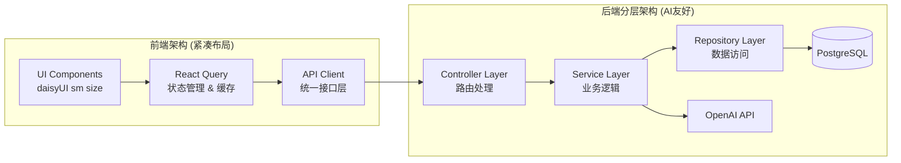

## 1. 概述

基于 Next.js + daisyUI 的智能工作记录与总结小工具，支持中英文国际化，集成 OpenAI 等 LLM 服务，为用户提供高效的工作记录、自动总结及智能助手功能。

---

## 2. 技术栈

- **前端**：Next.js (app/目录)、React + daisyUI
- **样式**：Tailwind CSS + daisyUI 组件库（所有 size 相关属性统一使用 sm）
- **状态管理**：React Query (TanStack Query) - 用于数据获取、缓存和状态管理
- **国际化**：next-i18next 或 next-intl
- **后端**：Next.js API Routes（分层架构设计，AI 友好）
- **数据库**：PostgreSQL (Prisma ORM)
- **AI 服务**：Vercel AI SDK + OpenAI API / 其他 LLM
- **可视化**：Recharts / Chart.js

---

## 3. 功能架构设计



### 前端架构特点

- **紧凑布局设计**：所有组件间距、padding、margin 采用紧凑设计
- **React Query 状态管理**：统一数据获取、缓存、同步和错误处理
- **AI 友好接口层**：标准化的 API 调用接口，便于 AI 理解和维护

### 后端分层架构

- **Controller Layer**：处理 HTTP 请求，参数验证，响应格式化
- **Service Layer**：核心业务逻辑，AI 集成，数据处理
- **Repository Layer**：数据库操作抽象，查询优化

### 核心功能模块

- **工作记录模块**：CRUD 任务记录；状态更新；标签 & 项目关联
- **智能总结模块**：手动触发，支持定期触发；调用 AI 生成报告；展示图表
- **Agent 助手模块**：实时分析；预测 & 建议；优先级排序

---

## 4. 数据库模型设计

```prisma
model User {
  id        String   @id @default(cuid())
  name      String
  email     String   @unique
  tasks     Task[]
}

model Project {
  id        String   @id @default(cuid())
  name      String
  tasks     Task[]
}

model Tag {
  id        String   @id @default(cuid())
  name      String   @unique
  tasks     Task[]  @relation(references: [id])
}

model Task {
  id            String    @id @default(cuid())
  user          User      @relation(fields: [userId], references: [id])
  userId        String
  project       Project?  @relation(fields: [projectId], references: [id])
  projectId     String?
  title         String
  description   String?
  status        String    @default("pending") // pending, in_progress, completed, canceled
  startTime     DateTime
  endTime       DateTime?
  duration      Int?      // minutes
  tags          Tag[]     @relation(references: [id])
  createdAt     DateTime  @default(now())
  updatedAt     DateTime  @updatedAt
}
```

---

## 5. 主要页面与组件结构

```text
/src/app                               # Next.js App Router
  |_ layout.tsx                        # 根布局 (紧凑设计)
  |_ page.tsx                          # 仪表盘
  |_ tasks
      |_ page.tsx                      # 任务列表
      |_ [id]
          |_ page.tsx                  # 任务详情与编辑
  |_ summary
      |_ daily
          |_ page.tsx                  # 日报
      |_ weekly
          |_ page.tsx                  # 周报
      |_ monthly
          |_ page.tsx                  # 月报
  |_ settings
      |_ page.tsx                      # 个人设置 / 国际化切换

/src/components                        # UI组件 (daisyUI sm size)
  |_ ui/
      |_ TaskList.tsx                  # 任务列表 (紧凑布局)
      |_ TaskForm.tsx                  # 新建/编辑任务 (sm size)
      |_ SummaryCard.tsx               # 总结报告卡片 (紧凑)
      |_ ChartPanel.tsx                # 可视化图表容器
      |_ Sidebar.tsx                   # 侧边导航 (紧凑)
      |_ i18nSwitcher.tsx              # 语言切换

/src/lib                               # React Query & API层
  |_ api/
      |_ client.ts                     # API客户端配置
      |_ tasks.ts                      # 任务相关API
      |_ summary.ts                    # 总结相关API
      |_ agent.ts                      # AI助手API
  |_ hooks/
      |_ useTasks.ts                   # 任务数据hooks
      |_ useSummary.ts                 # 总结数据hooks
      |_ useAgent.ts                   # AI助手hooks
  |_ query/
      |_ queryClient.ts                # React Query配置
      |_ keys.ts                       # Query keys管理
```

---

## 6. API 接口设计 (分层架构)

### Controller Layer - API Routes

| 路由                   | 方法   | 描述                 | 请求体 / 参数                                 | 返回值                    |
| ---------------------- | ------ | -------------------- | --------------------------------------------- | ------------------------- |
| /api/tasks             | GET    | 获取当前用户所有任务 | page, pageSize, status, project, tag          | Task\[]                   |
| /api/tasks             | POST   | 新建任务             | { title, desc, startTime, projectId, tagIds } | Task                      |
| /api/tasks/\[id]       | GET    | 获取单个任务详情     | id                                            | Task                      |
| /api/tasks/\[id]       | PUT    | 更新任务             | { status, endTime, duration, ... }            | Task                      |
| /api/tasks/\[id]       | DELETE | 删除任务             | id                                            | { success: boolean }      |
| /api/summary           | POST   | 生成 AI 总结报告     | { type: daily/weekly/monthly, date }          | { report: string, stats } |
| /api/agent/suggestions | GET    | 获取智能建议         | ?date, ?projectId                             | Suggestion\[]             |
| /api/ai/chat           | POST   | AI 对话接口          | { messages: Message[], stream?: boolean }     | StreamingResponse         |
| /api/ai/completion     | POST   | AI 文本补全          | { prompt: string, options?: CompletionOpts }  | CompletionResponse        |

### Service Layer - 业务逻辑

```typescript
// src/services/taskService.ts
export class TaskService {
  constructor(private taskRepository: TaskRepository) {}

  async getTasks(userId: string, filters: TaskFilters): Promise<Task[]>
  async createTask(userId: string, taskData: CreateTaskDto): Promise<Task>
  async updateTask(taskId: string, updateData: UpdateTaskDto): Promise<Task>
  async deleteTask(taskId: string): Promise<boolean>
}

// src/services/summaryService.ts
export class SummaryService {
  constructor(
    private taskRepository: TaskRepository,
    private aiService: AIService
  ) {}

  async generateSummary(type: SummaryType, date: Date): Promise<Summary>
}

// src/services/agentService.ts
export class AgentService {
  constructor(
    private taskRepository: TaskRepository,
    private aiService: AIService
  ) {}

  async getSuggestions(
    userId: string,
    context?: AgentContext
  ): Promise<Suggestion[]>
}

// src/services/aiService.ts (使用 Vercel AI SDK)
export class AIService {
  constructor(private openai: OpenAI) {}

  async generateCompletion(
    prompt: string,
    options?: CompletionOptions
  ): Promise<string>
  async streamChat(messages: Message[]): Promise<ReadableStream>
  async generateSummary(tasks: Task[], type: SummaryType): Promise<string>
  async generateSuggestions(context: AgentContext): Promise<Suggestion[]>
}
```

### Repository Layer - 数据访问

```typescript
// src/repositories/taskRepository.ts
export class TaskRepository {
  constructor(private prisma: PrismaClient) {}

  async findMany(filters: TaskFilters): Promise<Task[]>
  async findById(id: string): Promise<Task | null>
  async create(data: CreateTaskData): Promise<Task>
  async update(id: string, data: UpdateTaskData): Promise<Task>
  async delete(id: string): Promise<boolean>
}
```

---

## 7. 实现步骤与文件结构

1. **初始化项目**
   - `npx create-next-app@latest --typescript --app`
   - 安装依赖：`daisyui`, `tailwindcss`, `prisma`, `@prisma/client`, `@tanstack/react-query`, `ai`, `@ai-sdk/openai`, `next-i18next` 等

2. **配置 Tailwind & daisyUI (紧凑布局)**
   - 更新 `tailwind.config.js`
   - 配置 daisyUI 主题，设置默认 size 为 sm
   - 自定义紧凑布局的 spacing 配置

3. **React Query 状态管理配置**
   - 配置 QueryClient 和 QueryClientProvider
   - 设置缓存策略和错误处理
   - 创建自定义 hooks 封装 API 调用

4. **国际化集成**
   - 配置 `next-i18next.config.js`
   - 创建 `public/locales/{en,zh}/common.json`

5. **数据库 & ORM**
   - 编写 `schema.prisma`
   - 运行 `npx prisma migrate dev`

6. **后端分层架构搭建**
   - 创建 Repository Layer (数据访问层)
   - 创建 Service Layer (业务逻辑层)
   - 创建 Controller Layer (API 路由层)
   - 实现依赖注入和错误处理

7. **前端组件开发 (紧凑设计)**
   - 搭建基本布局与导航 (使用 daisyUI sm size)
   - 实现任务列表与 CRUD (紧凑布局)
   - 集成 React Query 进行数据管理

8. **AI 接口集成 (使用 Vercel AI SDK)**
   - 在 Service Layer 中集成 Vercel AI SDK
   - 实现流式响应和文本补全功能
   - 配置 AI 路由使用 Vercel AI SDK 的标准模式
   - 实现 prompt 模板 & 并发调用控制
   - 通过 Repository 层访问历史数据

9. **可视化与报告**
   - 使用 Recharts 绘制时间趋势图、饼图等
   - 实现紧凑的图表布局

10. **Agent 模块**
    - 开发 AgentService 业务逻辑
    - 利用历史数据 & AI 生成预测与建议
    - 通过 React Query 管理 AI 响应缓存

11. **测试 & 部署**
    - 单元测试 (Jest)
    - API 层测试
    - 部署到 Vercel / Netlify

**项目文件夹结构 (AI 友好分层架构)**：

```
├── public
│   └── locales
│       ├── en
│       └── zh
├── prisma
│   └── schema.prisma
├── src
│   ├── app                           # Next.js App Router
│   │   ├── layout.tsx               # 根布局 (紧凑设计)
│   │   ├── page.tsx                 # 仪表盘
│   │   ├── tasks/
│   │   │   ├── page.tsx
│   │   │   └── [id]/page.tsx
│   │   ├── summary/
│   │   │   ├── daily/page.tsx
│   │   │   ├── weekly/page.tsx
│   │   │   └── monthly/page.tsx
│   │   ├── settings/
│   │   │   └── page.tsx
│   │   └── api                      # API Routes (App Router)
│   │       ├── tasks/
│   │       │   ├── route.ts
│   │       │   └── [id]/route.ts
│   │       ├── summary/
│   │       │   └── route.ts
│   │       ├── agent/
│   │       │   └── suggestions/route.ts
│   │       └── ai/                  # AI相关路由 (Vercel AI SDK)
│   │           ├── chat/route.ts
│   │           └── completion/route.ts
│   ├── components                    # UI组件 (daisyUI sm)
│   │   ├── ui/                      # 基础UI组件
│   │   └── layout/                  # 布局组件
│   ├── lib                          # 核心库
│   │   ├── api/                     # API客户端
│   │   ├── hooks/                   # React Query hooks
│   │   ├── query/                   # Query配置
│   │   └── ai/                      # Vercel AI SDK配置
│   ├── services                     # Service Layer (业务逻辑)
│   │   ├── taskService.ts
│   │   ├── summaryService.ts
│   │   ├── agentService.ts
│   │   └── aiService.ts             # Vercel AI SDK集成
│   ├── repositories                 # Repository Layer (数据访问)
│   │   ├── taskRepository.ts
│   │   ├── userRepository.ts
│   │   └── base/
│   ├── types                        # TypeScript类型定义
│   │   ├── api.ts
│   │   ├── task.ts
│   │   ├── summary.ts
│   │   └── ai.ts                    # AI相关类型
│   ├── styles                       # 样式文件 (紧凑主题)
│   └── utils                        # 工具函数
├── tailwind.config.js               # Tailwind配置 (紧凑spacing)
├── next-i18next.config.js
├── package.json
└── README.md
```

## 8. AI 集成与第三方框架文档获取

### Vercel AI SDK 集成规范

所有 AI 相关的路由都必须使用 Vercel AI SDK，包括：

```typescript
// src/app/api/ai/chat/route.ts (使用 Vercel AI SDK)
import { openai } from '@ai-sdk/openai'
import { streamText } from 'ai'

export async function POST(req: Request) {
  const { messages } = await req.json()

  const result = await streamText({
    model: openai('gpt-4'),
    messages,
  })

  return result.toAIStreamResponse()
}

// src/app/api/ai/completion/route.ts
import { openai } from '@ai-sdk/openai'
import { generateText } from 'ai'

export async function POST(req: Request) {
  const { prompt, options } = await req.json()

  const { text } = await generateText({
    model: openai('gpt-4'),
    prompt,
    ...options,
  })

  return Response.json({ text })
}
```

### AI 服务层实现示例

```typescript
// src/services/aiService.ts
import { openai } from '@ai-sdk/openai'
import { generateText, streamText } from 'ai'

export class AIService {
  async generateSummary(tasks: Task[], type: SummaryType): Promise<string> {
    const prompt = this.buildSummaryPrompt(tasks, type)

    const { text } = await generateText({
      model: openai('gpt-4'),
      prompt,
      temperature: 0.7,
    })

    return text
  }

  async streamChat(messages: Message[]): Promise<ReadableStream> {
    const result = await streamText({
      model: openai('gpt-4'),
      messages,
    })

    return result.textStream
  }

  private buildSummaryPrompt(tasks: Task[], type: SummaryType): string {
    // 根据任务数据和类型构建 prompt
    return `根据以下任务数据生成${type}总结...`
  }
}
```

---

## 9. 设计原则总结

### UI/UX 设计原则

- **紧凑布局**：所有组件使用 daisyUI 的 sm size，减少不必要的空白
- **一致性**：统一的间距、字体大小和组件尺寸
- **响应式**：在紧凑的基础上保持良好的移动端体验

### 架构设计原则

- **分层清晰**：Controller → Service → Repository 三层架构
- **AI 友好**：标准化的接口、清晰的命名、完整的类型定义
- **可维护性**：单一职责、依赖注入、错误处理统一
- **性能优化**：React Query 缓存、数据库查询优化

### 开发规范

- **TypeScript 严格模式**：确保类型安全
- **统一的错误处理**：标准化的错误响应格式
- **API 文档化**：清晰的接口定义和注释
- **测试覆盖**：单元测试和集成测试
- **第三方框架使用**：开发时需参考最新的官方文档，确保使用最佳实践
  - Vercel AI SDK: 流式响应和文本生成的标准实现
  - React Query: 数据获取、缓存和状态同步
  - daisyUI: 组件 size 属性统一使用 sm
  - Prisma: 数据库操作和类型安全

---

以上优化方案在原有功能基础上，强化了紧凑布局设计、React Query 状态管理、后端分层架构等关键特性，使项目更加 AI 友好且具备良好的扩展性与可维护性。
